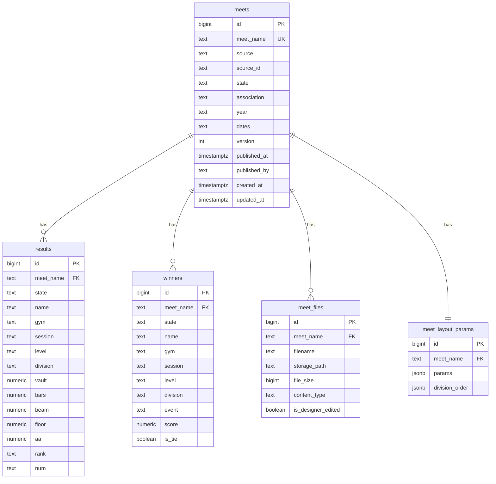

# feat: Centralized Supabase Database for Multi-Device Access

## Enhancement Summary

**Deepened on:** 2026-03-26
**Agents used:** 15 (Supabase Guardian, Architecture Strategist, Data Integrity Guardian, Data Migration Expert, Security Sentinel, Performance Oracle, Agent-Native Reviewer, Code Simplicity Reviewer, Pattern Recognition Specialist, TypeScript Reviewer, Deployment Verification Agent, Learnings Researcher, Best Practices Researcher, Frontend Design, Agent-Native Architecture)
**Institutional learnings applied:** 7/7 from docs/solutions/

### Critical Fixes Required Before Implementation

1. **NULL gym unique index mismatch** -- SQLite allows duplicate NULL gyms; PostgreSQL COALESCE prevents it. Fix: add `NOT NULL DEFAULT ''` to `gym` column in both schemas, coalesce on insert in `db_builder.py`. Without this, PDF-sourced meets with missing gyms will silently fail to publish.

2. **`publish_meet` race condition** -- SELECT version without `FOR UPDATE` allows concurrent publishes to read same version. Fix: `SELECT version INTO v_existing_version FROM meets WHERE meet_name = ... FOR UPDATE;`

3. **`SECURITY DEFINER` without `SET search_path`** -- Search path injection vulnerability. Fix: `LANGUAGE plpgsql SECURITY DEFINER SET search_path = '';` and qualify all table references as `public.meets`, `public.results`, etc.

4. **Storage bucket RLS policies not defined** -- Without INSERT/SELECT/UPDATE policies on `storage.objects`, upsert will fail silently after first upload. Fix: add explicit storage policies in Phase 1 migration SQL.

5. **1000-row silent truncation** -- PostgREST default limit silently truncates `fetch_remote_meet` for meets with >1000 athletes. Fix: paginate with `.range()` or explicit high limit.

6. **`meet_name` consistency** (from learning: output-name-meet-name-must-match) -- `publishMeet()` should read meet_name from `context.outputName`, not accept it as a parameter. Name mismatch silently publishes empty meets.

7. **Layout params sanitization** (from learning: sticky-params-silently-exclude-athletes) -- Destructive filters (`exclude_levels`, `level_groups`) in `meet_layout_params` would propagate to all installations. Fix: allowlist sanitization before publish, or remove `meet_layout_params` table entirely (see simplification below).

### Architectural Refinements

8. **Collapse 5 phases to 3**: Phase 1+2 (Setup + Publish), Phase 2 (Access + UI), Phase 3 (Future/deferred). Current phases are too coupled to test independently.

9. **Replace `pending_syncs.json` with SQLite `sync_status` column** on local `meets` table. Eliminates a fragile file-based queue; uses the existing durable store. `published_at IS NULL` already identifies unpublished meets.

10. **Don't add supabase tools to `ALWAYS_AVAILABLE_TOOLS`** -- `fetch_remote_meet` writes to central DB, violating staging isolation during active processing. Gate to phases where central DB writes are safe, or add a runtime guard.

11. **Centralize `getCentralDbPath()`** in `paths.ts` so new modules don't reach into private helpers in `python-tools.ts` or `db-tools.ts`.

12. **Local SQLite migration path** -- `CREATE TABLE IF NOT EXISTS` doesn't add columns to existing DBs. Add `ALTER TABLE meets ADD COLUMN` try/catch migration in `finalize_meet` for all new columns.

13. **Unify `AppConfig` and `AppSettings`** into a single shared type in `src/shared/types.ts` before adding 4 new fields. Currently two interfaces drift.

### Performance Improvements

14. **Store `athlete_count` and `winner_count` on `meets` table** -- eliminates N+1 queries from Cloud Meets tab. Populate via `jsonb_array_length()` in RPC (not `SELECT count(*)`).

15. **Use TUS resumable uploads for files >6MB** (IDML files, large PDFs). Sequential uploads with per-file progress reporting.

16. **Manual `startAutoRefresh()`/`stopAutoRefresh()`** on Electron window focus/blur -- required by Supabase docs for non-browser environments.

17. **Drop `fetch-retry` dependency** -- `@supabase/supabase-js` v2.79+ has built-in automatic retries.

18. **Add `NOTIFY pgrst, 'reload schema'`** at end of migration SQL -- without this PostgREST cache may not see new tables.

### Security Hardening

19. **Add `supabaseAnonKey` to `SENSITIVE_KEYS`** for encryption at rest (consistency with other API keys).

20. **Revoke anon execute on `publish_meet`**: `REVOKE EXECUTE ON FUNCTION publish_meet FROM anon; GRANT EXECUTE ON FUNCTION publish_meet TO authenticated;`

21. **Add input validation in `publish_meet`**: meet_name pattern check, state allowlist, array size limits, score range constraints.

22. **Add explicit DELETE RLS policies** (or document that all deletes must go through SECURITY DEFINER RPC).

23. **Round scores to 3 decimal places** before JSONB serialization to prevent float-to-NUMERIC precision loss.

### Agent-Native Parity

24. **Add `get_remote_meet_detail` tool** -- agent cannot inspect remote meets without downloading. Critical parity gap.

25. **Split `fetch_remote_meet` into primitives** -- `fetch_remote_meet_data` (data only) + `download_meet_file` (files). Matches UI separation.

26. **Add Supabase context to system prompt** -- `loadBasePrompt()` and `output_finalize` phase prompt need cloud sync sections.

27. **Include `list_remote_meets` in query conversation tools** so agent can browse cloud meets from Query Results tab.

### Supporting Artifacts Created

- **Frontend design doc**: `docs/designs/2026-03-26-cloud-meets-tab-design.md` -- component architecture, state management, visual design
- **Deployment checklist**: 23 SQL verification queries, per-phase Go/No-Go gates, rollback procedures, 24-hour monitoring plan (in deployment review output)

---

## Overview

Add Supabase as a centralized cloud database and file storage layer for finalized meet results. Multiple installations of the CHP Meet Scores Electron app on different computers will be able to publish finalized meets (data + documents) to Supabase and access meets published by other installations. Local SQLite staging continues for in-progress work; Supabase is the final destination for completed meets.

## Problem Statement

Currently, each installation of the app is an island. Meet results, winner data, and generated documents (PDFs, IDML) exist only on the machine that processed them. If a meet is processed on a laptop but order forms need to be printed from a desktop, the files must be manually transferred. There is no shared source of truth for finalized championship data, no way to query results across machines, and no centralized archive of deliverables.

## Proposed Solution

### Architecture: Local-First with Publish-to-Cloud

```
                       ┌─────────────────────────┐
                       │    Supabase (Cloud)      │
                       │  ┌─────────────────────┐ │
                       │  │ PostgreSQL           │ │
                       │  │  results, winners,   │ │
                       │  │  meets, meet_files   │ │
                       │  └─────────────────────┘ │
                       │  ┌─────────────────────┐ │
                       │  │ Storage Buckets      │ │
                       │  │  meet-documents/     │ │
                       │  └─────────────────────┘ │
                       └────────┬────────┬────────┘
                     publish ↑  │  ↑ publish
                             │  │  │
              ┌──────────────┘  │  └──────────────┐
              │            pull ↓                  │
    ┌─────────┴─────────┐              ┌──────────┴────────┐
    │  Computer A        │              │  Computer B        │
    │  ┌───────────────┐ │              │  ┌───────────────┐ │
    │  │ staging.db    │ │              │  │ staging.db    │ │
    │  │ (in-progress) │ │              │  │ (in-progress) │ │
    │  └───────┬───────┘ │              │  └───────┬───────┘ │
    │    finalize_meet   │              │    finalize_meet   │
    │  ┌───────┴───────┐ │              │  ┌───────┴───────┐ │
    │  │ chp_results.db│ │              │  │ chp_results.db│ │
    │  │ (local central)│ │              │  │ (local central)│ │
    │  └───────────────┘ │              │  └───────────────┘ │
    └────────────────────┘              └────────────────────┘
```

**Key design decisions:**

1. **Push-only sync model** -- Computer A publishes finalized meets; Computer B pulls on demand. No bidirectional sync, no real-time subscriptions (too complex for the use case).

2. **Supabase Storage for documents** -- All finalized PDFs and IDML files uploaded to Supabase Storage buckets, downloadable by any installation.

3. **Local SQLite unchanged** -- The staging DB pattern, phase architecture, and Python pipeline remain untouched. All Supabase operations go through the TypeScript layer.

4. **Publish is a post-finalization step** -- Embedded in `finalize_meet` (automatic when enabled) and `import_pdf_backs` (re-upload updated files). Failure does not block local finalization.

5. **Shared organization credentials** -- Single Supabase anon key shared across all installations (it's designed to be public). RLS policies enforce basic access control. No per-user authentication needed initially.

## Technical Approach

### Architecture

#### Supabase PostgreSQL Schema

```sql
-- Mirror of local SQLite schema with PostgreSQL improvements

CREATE TABLE meets (
    id BIGINT GENERATED ALWAYS AS IDENTITY PRIMARY KEY,
    meet_name TEXT UNIQUE NOT NULL,
    source TEXT,             -- 'scorecat', 'mso', 'generic', 'html', 'pdf'
    source_id TEXT,
    source_name TEXT,
    state TEXT NOT NULL,
    association TEXT,
    year TEXT NOT NULL,
    dates TEXT,
    version INTEGER DEFAULT 1,
    athlete_count INTEGER DEFAULT 0,
    winner_count INTEGER DEFAULT 0,
    published_at TIMESTAMPTZ DEFAULT NOW(),
    published_by TEXT,       -- installation ID (machine identifier)
    created_at TIMESTAMPTZ DEFAULT NOW(),
    updated_at TIMESTAMPTZ DEFAULT NOW()
);

CREATE TABLE results (
    id BIGINT GENERATED ALWAYS AS IDENTITY PRIMARY KEY,
    state TEXT NOT NULL,
    meet_name TEXT NOT NULL REFERENCES meets(meet_name) ON DELETE CASCADE ON UPDATE CASCADE,
    association TEXT,
    name TEXT NOT NULL,
    gym TEXT NOT NULL DEFAULT '',  -- COALESCE to '' on insert; prevents NULL uniqueness issues
    session TEXT NOT NULL,
    level TEXT NOT NULL,
    division TEXT NOT NULL,
    vault NUMERIC(5,3),
    bars NUMERIC(5,3),
    beam NUMERIC(5,3),
    floor NUMERIC(5,3),
    aa NUMERIC(6,3),
    rank TEXT,
    num TEXT,
    created_at TIMESTAMPTZ DEFAULT NOW()
);

CREATE UNIQUE INDEX idx_results_unique
    ON results(meet_name, name, gym, session, level, division);

CREATE INDEX idx_results_meet_sld
    ON results(meet_name, session, level, division);

CREATE TABLE winners (
    id BIGINT GENERATED ALWAYS AS IDENTITY PRIMARY KEY,
    state TEXT NOT NULL,
    meet_name TEXT NOT NULL REFERENCES meets(meet_name) ON DELETE CASCADE ON UPDATE CASCADE,
    association TEXT,
    name TEXT NOT NULL,
    gym TEXT NOT NULL DEFAULT '',
    session TEXT NOT NULL,
    level TEXT NOT NULL,
    division TEXT NOT NULL,
    event TEXT NOT NULL,      -- 'vault', 'bars', 'beam', 'floor', 'aa'
    score NUMERIC(6,3),
    is_tie BOOLEAN DEFAULT FALSE,
    created_at TIMESTAMPTZ DEFAULT NOW()
);

CREATE UNIQUE INDEX idx_winners_unique
    ON winners(meet_name, name, gym, session, level, division, event);

CREATE INDEX idx_winners_meet_event_level
    ON winners(meet_name, event, level);

CREATE INDEX idx_winners_meet_gym
    ON winners(meet_name, gym);

-- Track which files are associated with each meet
CREATE TABLE meet_files (
    id BIGINT GENERATED ALWAYS AS IDENTITY PRIMARY KEY,
    meet_name TEXT NOT NULL REFERENCES meets(meet_name) ON DELETE CASCADE ON UPDATE CASCADE,
    filename TEXT NOT NULL,          -- e.g., 'back_of_shirt.pdf'
    storage_path TEXT NOT NULL,      -- Supabase Storage path
    file_size BIGINT,
    content_type TEXT,
    is_designer_edited BOOLEAN DEFAULT FALSE,
    uploaded_at TIMESTAMPTZ DEFAULT NOW()
);

CREATE UNIQUE INDEX idx_meet_files_unique
    ON meet_files(meet_name, filename);

-- Layout parameters for reproducibility on other machines
CREATE TABLE meet_layout_params (
    id BIGINT GENERATED ALWAYS AS IDENTITY PRIMARY KEY,
    meet_name TEXT UNIQUE NOT NULL REFERENCES meets(meet_name) ON DELETE CASCADE ON UPDATE CASCADE,
    params JSONB NOT NULL,           -- sticky layout params (font sizes, colors, etc.)
    division_order JSONB,            -- cached division ordering
    updated_at TIMESTAMPTZ DEFAULT NOW()
);
```

#### ERD Diagram



#### RLS Policies

```sql
-- Any authenticated user (including anonymous) can read all data
ALTER TABLE meets ENABLE ROW LEVEL SECURITY;
ALTER TABLE results ENABLE ROW LEVEL SECURITY;
ALTER TABLE winners ENABLE ROW LEVEL SECURITY;
ALTER TABLE meet_files ENABLE ROW LEVEL SECURITY;
ALTER TABLE meet_layout_params ENABLE ROW LEVEL SECURITY;

CREATE POLICY "Authenticated read all" ON meets
    FOR SELECT USING (auth.role() = 'authenticated');
CREATE POLICY "Authenticated insert" ON meets
    FOR INSERT WITH CHECK (auth.role() = 'authenticated');
CREATE POLICY "Authenticated update" ON meets
    FOR UPDATE USING (auth.role() = 'authenticated');

-- Same pattern for results, winners, meet_files, meet_layout_params
-- (all authenticated users can read, insert, update)

-- Storage bucket policies (REQUIRED or upsert fails silently after first upload)
CREATE POLICY "Authenticated can upload" ON storage.objects
  FOR INSERT WITH CHECK (bucket_id = 'meet-documents' AND (SELECT auth.role()) = 'authenticated');
CREATE POLICY "Authenticated can read" ON storage.objects
  FOR SELECT USING (bucket_id = 'meet-documents' AND (SELECT auth.role()) = 'authenticated');
CREATE POLICY "Authenticated can update" ON storage.objects
  FOR UPDATE USING (bucket_id = 'meet-documents' AND (SELECT auth.role()) = 'authenticated');

-- Schema cache reload (REQUIRED or PostgREST may not see new tables)
NOTIFY pgrst, 'reload schema';
```

#### Supabase Storage Bucket Structure

```
meet-documents/                          (private bucket, 100MB limit)
  {STATE}/{year}/{sanitized-meet-name}/
    back_of_shirt.pdf
    back_of_shirt.idml
    back_of_shirt_8.5x14.pdf
    order_forms.pdf
    gym_highlights.pdf
    gym_highlights_8.5x14.pdf
    meet_summary.txt
```

Example: `meet-documents/GA/2026/peach-state-classic/back_of_shirt.pdf`

#### Atomic Publish via PostgreSQL Function

Since Supabase REST API does not support multi-statement transactions, use an RPC function:

```sql
CREATE OR REPLACE FUNCTION publish_meet(
    p_meet JSONB,
    p_results JSONB,
    p_winners JSONB,
    p_layout_params JSONB DEFAULT NULL
) RETURNS JSONB AS $$
DECLARE
    v_existing_version INTEGER;
    v_result JSONB;
BEGIN
    -- Check for existing meet and get version (FOR UPDATE serializes concurrent publishes)
    SELECT version INTO v_existing_version
    FROM public.meets WHERE meet_name = (p_meet->>'meet_name')
    FOR UPDATE;

    -- Delete existing data (CASCADE handles results, winners, files, layout)
    DELETE FROM public.meets WHERE meet_name = (p_meet->>'meet_name');

    -- Insert meet metadata with bumped version
    INSERT INTO public.meets (meet_name, source, source_id, source_name, state,
                       association, year, dates, version, published_by,
                       athlete_count, winner_count)
    SELECT meet_name, source, source_id, source_name, state,
           association, year, dates,
           COALESCE(v_existing_version, 0) + 1,
           published_by,
           jsonb_array_length(p_results),
           jsonb_array_length(p_winners)
    FROM jsonb_to_record(p_meet) AS x(
        meet_name TEXT, source TEXT, source_id TEXT, source_name TEXT,
        state TEXT, association TEXT, year TEXT, dates TEXT, published_by TEXT
    );

    -- Insert results
    INSERT INTO public.results (state, meet_name, association, name, gym,
                         session, level, division, vault, bars, beam, floor, aa, rank, num)
    SELECT state, meet_name, association, COALESCE(name, ''), COALESCE(gym, ''),
           session, level, division, vault, bars, beam, floor, aa, rank, num
    FROM jsonb_to_recordset(p_results) AS x(
        state TEXT, meet_name TEXT, association TEXT, name TEXT, gym TEXT,
        session TEXT, level TEXT, division TEXT,
        vault NUMERIC, bars NUMERIC, beam NUMERIC, floor NUMERIC, aa NUMERIC,
        rank TEXT, num TEXT
    );

    -- Insert winners
    INSERT INTO public.winners (state, meet_name, association, name, gym,
                         session, level, division, event, score, is_tie)
    SELECT state, meet_name, association, name, gym,
           session, level, division, event, score, is_tie
    FROM jsonb_to_recordset(p_winners) AS x(
        state TEXT, meet_name TEXT, association TEXT, name TEXT, gym TEXT,
        session TEXT, level TEXT, division TEXT,
        event TEXT, score NUMERIC, is_tie BOOLEAN
    );

    -- Insert layout params if provided (sanitized through allowlist by caller)
    IF p_layout_params IS NOT NULL THEN
        INSERT INTO public.meet_layout_params (meet_name, params, division_order)
        VALUES (
            (p_meet->>'meet_name'),
            p_layout_params->'params',
            p_layout_params->'division_order'
        );
    END IF;

    v_result := jsonb_build_object(
        'meet_name', p_meet->>'meet_name',
        'version', COALESCE(v_existing_version, 0) + 1,
        'results_count', jsonb_array_length(p_results),
        'winners_count', jsonb_array_length(p_winners)
    );

    RETURN v_result;
END;
$$ LANGUAGE plpgsql SECURITY DEFINER SET search_path = '';

-- Lock down execution to authenticated users only
REVOKE EXECUTE ON FUNCTION publish_meet FROM anon;
GRANT EXECUTE ON FUNCTION publish_meet TO authenticated;
```

### Implementation Phases

#### Phase 1: Foundation (Supabase Client + Config)

Create the Supabase client module and extend configuration.

**Tasks and deliverables:**
- [ ] Create Supabase project (manual step, Supabase dashboard)
- [ ] Run schema SQL (create tables, indexes, RLS policies, RPC functions)
- [ ] Create `meet-documents` storage bucket (private, 100MB limit, allowed MIME types)
- [ ] Create `src/main/supabase-client.ts` -- singleton client with retry, anonymous auth, electron-store session persistence
- [ ] Extend `AppConfig` in `src/main/config-store.ts` with `supabaseUrl`, `supabaseAnonKey`, `supabaseEnabled`
- [ ] Generate TypeScript types from Supabase schema (`src/types/database.types.ts`)
- [ ] Install `@supabase/supabase-js` and `fetch-retry` dependencies
- [ ] Add `installationId` to config (UUID generated on first launch, used as `published_by`)

**Key file changes:**
| File | Change |
|------|--------|
| `src/main/supabase-client.ts` | NEW -- `initSupabase()`, `getSupabaseClient()`, `isSupabaseEnabled()` |
| `src/main/config-store.ts` | Add `supabaseUrl`, `supabaseAnonKey`, `supabaseEnabled`, `installationId` to `AppConfig` |
| `src/types/database.types.ts` | NEW -- generated Supabase types |
| `package.json` | Add `@supabase/supabase-js`, `fetch-retry` |

**Success criteria:**
- [ ] `getSupabaseClient()` returns a typed client when config is set, null when disabled
- [ ] Client authenticates anonymously on first use
- [ ] Session persists via electron-store across app restarts
- [ ] `supabaseEnabled: false` completely prevents any network calls

#### Phase 2: Publish Flow (Data + Documents)

Add the ability to push finalized meet data and documents to Supabase.

**Tasks and deliverables:**
- [ ] Create `src/main/supabase-sync.ts` with:
  - `publishMeetData(meetName, centralDbPath)` -- reads local SQLite, calls `publish_meet` RPC
  - `uploadMeetFiles(meetName)` -- scans output dir, uploads each file to Supabase Storage
  - `publishMeet(meetName, centralDbPath)` -- orchestrates data + files
- [ ] Extend `finalize_meet` in `src/main/tools/python-tools.ts` to call `publishMeet()` after local transaction succeeds
- [ ] Extend `toolImportPdfBacks` in `src/main/context-tools.ts` to call `uploadMeetFiles()` after Python completes
- [ ] Add `published_at` and `published_by` columns to local SQLite `meets` table (in `db_builder.py`)
- [ ] Handle publish failures gracefully -- log warning, return success with sync status
- [ ] Add pending sync queue: if publish fails, persist to `data/pending_syncs.json`, retry on next app launch

**Key file changes:**
| File | Change |
|------|--------|
| `src/main/supabase-sync.ts` | NEW -- publish orchestration |
| `src/main/tools/python-tools.ts` | Extend `finalize_meet` (after line 344) |
| `src/main/context-tools.ts` | Extend `toolImportPdfBacks` (after Python completes) |
| `python/core/db_builder.py` | Add `published_at`, `published_by` to `meets` CREATE TABLE |
| `data/pending_syncs.json` | NEW -- queued publish operations |

**Publish flow detail:**

```
finalize_meet() completes local SQLite transaction
  ├── if supabaseEnabled:
  │   ├── Read results, winners, meets from local central DB
  │   ├── Call publish_meet RPC (atomic, all-or-nothing)
  │   ├── Upload files from getOutputDir(meetName) to Storage
  │   ├── Update meet_files table with storage paths
  │   ├── Update local meets.published_at
  │   └── On failure: save to pending_syncs.json, warn user
  └── return finalization message (includes sync status)
```

**Success criteria:**
- [ ] `finalize_meet` publishes data + files to Supabase when enabled and online
- [ ] `import_pdf_backs` re-uploads updated documents (with `is_designer_edited: true`)
- [ ] Publish failure does not block local finalization
- [ ] Pending syncs retry on next app launch
- [ ] `version` field increments on re-publish

#### Phase 3: Access Flow (Browse + Download Remote Meets)

Allow any installation to discover and download meets published by other installations.

**Tasks and deliverables:**
- [ ] Create `src/main/tools/supabase-tools.ts` with:
  - `list_remote_meets` -- queries Supabase `meets` table, returns meet list with metadata
  - `fetch_remote_meet` -- downloads a meet's data into local `chp_results.db` + downloads files to `getOutputDir(meetName)`
  - `download_meet_file` -- downloads a specific file from Supabase Storage
- [ ] Register tools in `src/main/tools/index.ts`
- [ ] Add tool definitions in `src/main/tool-definitions.ts`
- [ ] Make tools always-available (not phase-gated) since browsing remote meets is useful at any time
- [ ] Add `origin` column to local `meets` table (`local` vs `remote`) to distinguish downloaded data
- [ ] Add `remote_version` column to track which version was downloaded (for cache invalidation)

**Key file changes:**
| File | Change |
|------|--------|
| `src/main/tools/supabase-tools.ts` | NEW -- remote meet tools |
| `src/main/tools/index.ts` | Register supabase tools |
| `src/main/tool-definitions.ts` | Add list_remote_meets, fetch_remote_meet, download_meet_file definitions |
| `src/main/workflow-phases.ts` | Add supabase tools to ALWAYS_AVAILABLE_TOOLS |
| `python/core/db_builder.py` | Add `origin`, `remote_version` to `meets` CREATE TABLE |

**Access flow detail:**

```
User (or agent) calls list_remote_meets
  ├── Query Supabase meets table (optionally filter by state, year)
  ├── Return list: meet_name, state, year, published_at, published_by, version
  └── Highlight meets not yet cached locally

User (or agent) calls fetch_remote_meet(meetName)
  ├── Download results + winners + meets + layout_params from Supabase
  ├── Insert into local chp_results.db (with origin='remote')
  ├── Download files from Supabase Storage to getOutputDir(meetName)
  ├── Record remote_version in local meets table
  └── Return summary of downloaded data
```

**Success criteria:**
- [ ] `list_remote_meets` shows all published meets from Supabase
- [ ] `fetch_remote_meet` downloads data into local SQLite and files to output dir
- [ ] Downloaded meets queryable via existing `query_db` tool (no changes needed)
- [ ] Remote meets marked with `origin='remote'` in local DB
- [ ] Re-fetching a meet updates local data if remote version is higher

#### Phase 4: Cloud Meets Tab + Settings UI

Add a new "Cloud Meets" tab to the Electron app for browsing, viewing, and downloading meets from the central Supabase database. Also add Supabase configuration to Settings.

**Cloud Meets Tab -- `src/renderer/components/CloudMeetsTab.tsx` (NEW)**

A fourth tab alongside Process, Query Results, and Settings. The tab provides:

1. **Connection status banner** -- shows whether Supabase is configured and connected. If not configured, displays a link to Settings with setup instructions.

2. **Meet browser** -- a table/list of all meets published to Supabase, showing:
   - Meet name
   - State
   - Year
   - Association (USAG/Xcel)
   - Published date
   - Published by (installation ID / machine name)
   - Version number
   - Number of athletes / winners
   - Sync status indicator: "Downloaded" (cached locally), "Available" (not cached), "Update available" (remote version > cached version)

3. **Meet detail view** -- clicking a meet expands/navigates to show:
   - Meet metadata (source, dates, association)
   - Winners summary (count by level, count by event)
   - **Document list** -- all files stored in Supabase Storage for this meet:
     - `back_of_shirt.pdf` (with "Designer edited" badge if `is_designer_edited`)
     - `back_of_shirt.idml`
     - `back_of_shirt_8.5x14.pdf`
     - `order_forms.pdf`
     - `gym_highlights.pdf`
     - `gym_highlights_8.5x14.pdf`
     - `meet_summary.txt`
   - Each document has:
     - **Download button** -- downloads the file to `getOutputDir(meetName)` and opens in default app
     - **Open button** (if already downloaded locally)
     - File size and upload date

4. **Bulk actions:**
   - "Download All Files" for a meet
   - "Fetch Meet Data" to pull results/winners into local SQLite for querying
   - "Refresh" to re-check Supabase for new/updated meets

**Tab layout sketch:**

```
┌──────────────────────────────────────────────────────┐
│  [Process] [Query Results] [Cloud Meets] [Settings]  │
├──────────────────────────────────────────────────────┤
│  ☁ Connected to Supabase          [Refresh]          │
├──────────────────────────────────────────────────────┤
│  Filter: [State ▼] [Year ▼] [Search...         ]    │
├──────────────────────────────────────────────────────┤
│  ┌─ Georgia State Championships 2026 ──── ✅ Local ─┐│
│  │  GA | 2026 | USAG | v3 | Published Mar 15       ││
│  │  492 athletes | 287 winners                       ││
│  │  [View Details] [Download All]                    ││
│  └──────────────────────────────────────────────────┘│
│  ┌─ Kentucky State Championships 2026 ── ☁ Remote ──┐│
│  │  KY | 2026 | USAG | v1 | Published Mar 20       ││
│  │  380 athletes | 215 winners                       ││
│  │  [View Details] [Fetch & Download]                ││
│  └──────────────────────────────────────────────────┘│
│  ┌─ Nebraska State Championships 2026 ── ⬆ Update ──┐│
│  │  NE | 2026 | USAG | v2 (local: v1)              ││
│  │  [View Details] [Update to v2]                    ││
│  └──────────────────────────────────────────────────┘│
└──────────────────────────────────────────────────────┘
```

**Detail view (expanded):**

```
┌─ Georgia State Championships 2026 ─────────────────┐
│  State: GA | Year: 2026 | Source: MSO              │
│  Dates: March 14-15, 2026 | USAG                   │
│  Published: Mar 15 by Laptop-A | Version 3          │
│  492 athletes | 287 winners across 8 levels         │
│                                                      │
│  Documents:                                          │
│  ┌────────────────────────────────────────────────┐ │
│  │ 📄 back_of_shirt.pdf    (4.2 MB) [⬇ Download] │ │
│  │    ✏ Designer edited | Uploaded Mar 16         │ │
│  │ 📄 back_of_shirt.idml   (8.1 MB) [⬇ Download] │ │
│  │ 📄 order_forms.pdf      (12.3 MB)[⬇ Download] │ │
│  │ 📄 gym_highlights.pdf   (5.7 MB) [⬇ Download] │ │
│  │ 📄 meet_summary.txt     (2 KB)   [⬇ Download] │ │
│  └────────────────────────────────────────────────┘ │
│                                                      │
│  [Download All Files] [Fetch Data to Local DB]       │
│  [Back to List]                                      │
└──────────────────────────────────────────────────────┘
```

**Tasks and deliverables:**
- [ ] Create `src/renderer/components/CloudMeetsTab.tsx` -- main tab component with meet list, filters, detail view
- [ ] Create `src/renderer/components/CloudMeetDetail.tsx` -- expanded view with documents and download actions
- [ ] Add "Cloud Meets" tab to `src/renderer/App.tsx` tab bar
- [ ] Add "Cloud Sync" section to `src/renderer/components/SettingsTab.tsx`:
  - Supabase URL field
  - Supabase anon key field
  - Enable/disable toggle
  - Connection test button
  - Installation ID display (read-only)
- [ ] Add IPC handlers in `src/main/main.ts` for:
  - `test-supabase-connection` -- verifies credentials
  - `list-cloud-meets` -- queries Supabase meets table with optional filters
  - `get-cloud-meet-detail` -- fetches meet metadata + file list
  - `download-cloud-file` -- downloads a specific file from Supabase Storage to local output dir
  - `fetch-cloud-meet-data` -- downloads results/winners into local SQLite
  - `get-sync-status` -- returns list of meets with their publish status
  - `retry-pending-syncs` -- retriggers queued publishes
- [ ] Extend `ElectronAPI` in `src/preload/preload.ts` with new IPC channels
- [ ] Add sync status indicator to Process tab (optional) -- shows "Published" / "Not published" / "Publish failed" after finalization

**Key file changes:**
| File | Change |
|------|--------|
| `src/renderer/components/CloudMeetsTab.tsx` | NEW -- cloud meets browser with list + detail views |
| `src/renderer/components/CloudMeetDetail.tsx` | NEW -- expanded meet view with document download |
| `src/renderer/App.tsx` | Add Cloud Meets tab to tab bar |
| `src/renderer/components/SettingsTab.tsx` | Add Cloud Sync section |
| `src/main/main.ts` | Add IPC handlers for all cloud operations |
| `src/preload/preload.ts` | Extend `ElectronAPI` with new channels |

**Success criteria:**
- [ ] Cloud Meets tab shows all published meets from Supabase with filters
- [ ] Meet detail view shows documents with download buttons
- [ ] Downloaded files land in `getOutputDir(meetName)` and can be opened
- [ ] "Fetch Data" pulls results/winners into local SQLite for querying in Query Results tab
- [ ] Sync status indicators show Downloaded / Available / Update Available
- [ ] Tab gracefully shows setup instructions when Supabase is not configured
- [ ] User can configure Supabase credentials in Settings
- [ ] Connection test confirms working connectivity
- [ ] User can retry failed publishes

#### Phase 5: Migration + Polish (Future)

Migrate existing local data and handle edge cases.

**Tasks and deliverables:**
- [ ] Add "Migrate existing meets" dialog -- shows local meets not yet published, with checkboxes
- [ ] Bulk publish selected meets (with progress bar)
- [ ] Conflict detection on publish -- warn if remote version exists from different installation
- [ ] Last-write-wins with confirmation dialog: show what will be overwritten
- [ ] Cache invalidation: on app launch, check if remote versions are newer than cached versions
- [ ] Optional: add sync status column to Query Results tab list

**Success criteria:**
- [ ] Pre-existing local meets can be published in bulk
- [ ] User is warned before overwriting another installation's data
- [ ] Stale cached data is detectable and refreshable

## Alternative Approaches Considered

### 1. Full Bidirectional Sync (PowerSync / ElectricSQL)

**Why rejected:** Massive complexity for a single-writer use case. PowerSync adds a sync layer that replicates entire tables bidirectionally with CRDT conflict resolution. This project has no concurrent editors -- one machine processes a meet, publishes it, and others read it. The publish-then-pull model is orders of magnitude simpler.

### 2. Supabase Realtime Subscriptions

**Why rejected:** Adds persistent WebSocket connections, reconnection logic, and channel management. The data flow is not real-time -- meets are published periodically and consumed on-demand. Simple polling/manual refresh is sufficient and works naturally with offline scenarios.

### 3. Python Direct Supabase Access (supabase-py)

**Why rejected:** Would require adding the Supabase Python client to the PyInstaller bundle (adding httpx, gotrue, storage3, postgrest dependencies), creating a second auth path, and plumbing credentials through to Python. The TypeScript layer already orchestrates the pipeline and has all the data after Python finishes. Keeping all cloud operations in TypeScript maintains a clean separation.

### 4. Shared Filesystem (OneDrive/Google Drive)

**Why rejected:** SQLite file-level locking is not safe across network filesystems. OneDrive sync conflicts can corrupt the database. The existing `_safe_move()` code in process_meet.py already handles OneDrive file-locking issues for output files, suggesting this has been painful before. A proper database (Supabase PostgreSQL) eliminates these problems.

### 5. New "PUBLISH" Workflow Phase

**Why rejected:** Adding a sixth phase would require the inner agent to explicitly transition to it, adding fragility. Publishing is a side-effect of finalization, not a user-facing workflow step. Embedding it in `finalize_meet` follows the "architecture over prompting" principle -- the agent cannot skip it.

## System-Wide Impact

### Interaction Graph

**Publish chain:** `finalize_meet()` -> `publishMeet()` -> `supabase.rpc('publish_meet')` + `supabase.storage.upload()` -> update local `meets.published_at`

**Access chain:** `list_remote_meets` -> `supabase.from('meets').select()` -> display in UI/agent -> `fetch_remote_meet` -> `supabase.from('results').select()` + `supabase.storage.download()` -> insert into local `chp_results.db`

**Re-publish chain:** `import_pdf_backs` -> Python pipeline -> `uploadMeetFiles()` -> Supabase Storage (upsert) + update `meet_files` table

### Error Propagation

- **Network failure during publish:** Caught in `publishMeet()`, logged as warning, saved to `pending_syncs.json`. Local finalization succeeds regardless. App retries on next launch.
- **Supabase RPC failure:** The `publish_meet` function runs in a transaction. Partial failure is impossible -- it either succeeds completely or rolls back entirely.
- **Storage upload failure:** Individual file failures are caught. Partial uploads are safe because `upsert: true` means re-upload works. The `meet_files` table only records successful uploads.
- **Download failure:** `fetch_remote_meet` is idempotent. Partial downloads can be retried. Local data is only committed after all downloads succeed.

### State Lifecycle Risks

- **Pending sync queue corruption:** If `pending_syncs.json` is corrupted, pending publishes are lost. Mitigation: the local SQLite `published_at` being NULL indicates unpublished meets; the queue is an optimization, not the sole record.
- **Local DB diverges from Supabase:** If a meet is re-processed locally but publish fails, local and remote are out of sync. The `version` field and `published_at` timestamp track this. The UI should show "unpublished changes" when `published_at < updated_at`.
- **Remote meet deleted but cached locally:** The `origin='remote'` flag allows distinguishing cached remote data from locally-processed data. A "refresh" action can re-validate cached data.

### API Surface Parity

New tools (`list_remote_meets`, `fetch_remote_meet`, `download_meet_file`) follow the same executor pattern as existing tools. They return strings, accept typed args, and are registered in `allToolExecutors`. The inner agent can use them in the Query Results tab conversation.

### Integration Test Scenarios

1. **End-to-end publish:** Process a meet locally through all 5 phases, finalize, verify data appears in Supabase PostgreSQL and files appear in Storage bucket.
2. **Cross-machine access:** Publish from machine A, then on machine B call `list_remote_meets` -> `fetch_remote_meet` -> `query_db` on the fetched data.
3. **Offline publish resilience:** Disconnect network, finalize a meet, verify local finalization succeeds and publish is queued. Reconnect, verify pending sync completes.
4. **Re-publish after import_backs:** Import designer-edited backs on machine A, verify Supabase Storage files update and `is_designer_edited` flag is set.
5. **Version conflict:** Publish same meet from two machines, verify version increments and second publish includes warning about overwriting.

## Acceptance Criteria

### Functional Requirements

- [ ] Supabase credentials configurable in Settings UI with connection test
- [ ] Finalized meets automatically publish to Supabase when enabled and online
- [ ] Publish includes all structured data (results, winners, meets) and all output files
- [ ] Import_backs re-publishes updated documents
- [ ] Any installation can list and download published meets
- [ ] Downloaded meets are queryable via existing query_db tool
- [ ] Publish failures do not block local finalization
- [ ] Failed publishes queue for retry on next app launch
- [ ] `supabaseEnabled: false` prevents all network calls
- [ ] New Cloud Meets tab provides browsable list of all published meets with state/year filters
- [ ] Cloud Meets tab shows document list per meet with individual download buttons
- [ ] Users can download any published PDF, IDML, or summary file to the local output directory
- [ ] Sync status badges (Downloaded / Available / Update Available) on each meet

### Non-Functional Requirements

- [ ] Publish adds <30 seconds to finalization for a typical meet (~500 athletes, ~100 winners, 5-6 files)
- [ ] All Supabase operations include retry with exponential backoff (3 retries)
- [ ] Supabase anon key stored in config (public by design); no service role key in client
- [ ] TypeScript types generated from Supabase schema; all queries type-safe
- [ ] No Python changes required for Phase 1-2

### Quality Gates

- [ ] Existing vitest test suite continues passing (38 tests)
- [ ] Publish/access flows manually tested across two machines
- [ ] Offline mode tested: processing works fully without Supabase
- [ ] Build succeeds: `npm run build` clean

## Success Metrics

- Any finalized meet is accessible from any installation within 60 seconds of finalization
- Zero data loss: local SQLite always succeeds regardless of Supabase status
- Pre-existing meets can be migrated to Supabase in bulk

## Dependencies & Prerequisites

1. **Supabase project** -- Need to create a project on supabase.com (free tier sufficient initially: 500MB database, 1GB storage, 50K monthly active users)
2. **Electron version** -- Must verify Electron version bundles Node.js 20+ for `@supabase/supabase-js@2.79+`. If on Electron 28 (Node 18), pin to `@supabase/supabase-js@2.78.0` or upgrade Electron.
3. **`@supabase/supabase-js` package** -- ~200KB addition to bundle, negligible for Electron
4. **`fetch-retry` package** -- For resilient HTTP requests
5. **Architecture bug fixes (v0.3.4)** -- The 5 architecture bugs should be fixed before adding more complexity. This feature should target v0.4.0+.

## Risk Analysis & Mitigation

| Risk | Severity | Likelihood | Mitigation |
|------|----------|-----------|------------|
| Network failure during publish | High | High | Non-blocking publish + pending sync queue. Local always succeeds. |
| Schema divergence (local vs Supabase) | High | Medium | Version field on meets table. Schema migration scripts. Type generation catches mismatches at compile time. |
| Two machines overwrite same meet | Medium | Medium | Version counter + warning dialog before overwrite. Last-write-wins with confirmation. |
| Supabase free tier limits | Medium | Low | 500MB DB + 1GB storage covers ~200 meets. Monitor usage; upgrade to Pro tier ($25/mo) when needed. |
| Supabase service outage | Low | Low | App works fully offline. Publish queues for retry. |
| API key extracted from Electron binary | Low | Medium | Anon key is designed to be public. RLS policies enforce access control. No service role key in client. |

## Resource Requirements

- **Supabase project:** Free tier initially, Pro tier ($25/mo) when storage exceeds 1GB
- **npm packages:** `@supabase/supabase-js`, `fetch-retry`
- **Development effort:** Phase 1-2 (publish) can be done in one focused session. Phase 3-4 (access + UI) in a second session. Phase 5 (migration) as follow-up.

## Future Considerations

- **Web dashboard:** Once data is in Supabase, a web dashboard (Next.js + Supabase) could provide read-only access to results for coaches, parents, etc.
- **Per-user auth:** If the app is distributed beyond the current team, add Supabase Auth with email/password sign-in and per-user RLS policies.
- **Realtime notifications:** If live status updates become needed (e.g., "Computer A just published Georgia 2026"), add Supabase Realtime subscriptions.
- **Historical versioning:** Store previous versions of meets in a `meets_history` table for audit trails.
- **Supabase Edge Functions:** For operations that need server-side logic (e.g., validating data integrity before publish), use Edge Functions with the service role key.

## Agent-Native Architecture Review

Analysis of this plan through the lens of the agent-native architecture principles (Parity, Granularity, Composability, Emergent Capability, Improvement Over Time).

### 1. Tool Design Assessment

**`list_remote_meets` -- Well designed.** Clear name, descriptive of capability. The optional `state` and `year` filters follow the "inputs are data, not decisions" principle. Returns rich output (meet name, state, year, published_at, version, sync status). One suggestion: include `athlete_count` and `winner_count` in the response so the agent can answer questions like "which state had the most athletes?" without a follow-up call.

**`fetch_remote_meet` -- Well designed but name is slightly ambiguous.** "Fetch" could mean "get metadata" or "download everything." The plan clarifies it downloads data + files into local DB/filesystem. The name is acceptable because the description disambiguates. The tool correctly returns a summary of what was downloaded (rich output). One improvement: return the local paths of downloaded files so the agent can immediately open them for the user without needing to call `list_output_files`.

**`download_meet_file` -- Reconsider necessity.** This tool downloads a single file from Supabase Storage. `fetch_remote_meet` already downloads all files. The only scenario where `download_meet_file` is useful is selective download (e.g., "just get the order forms PDF"). This is a valid granularity choice -- it follows the "atomic primitives" principle by letting the agent download individual files. Keep it, but ensure `fetch_remote_meet` does not duplicate this work redundantly (i.e., `fetch_remote_meet` should use `download_meet_file` internally or share the same download logic).

### 2. Parity Analysis (Agent vs UI Capability Map)

The plan introduces a Cloud Meets tab with several UI actions. Here is the parity map:

| Cloud Meets UI Action | Agent Tool | Status |
|----------------------|------------|--------|
| View list of published meets | `list_remote_meets` | Done |
| Filter by state/year | `list_remote_meets` (state, year params) | Done |
| Search meets | `list_remote_meets` (needs `query` param) | MISSING |
| View meet detail (metadata, winners summary) | `get_meet_summary` (local) or need remote equivalent | MISSING |
| Download individual file | `download_meet_file` | Done |
| Download all files | `fetch_remote_meet` | Done |
| Fetch meet data to local DB | `fetch_remote_meet` | Done |
| Refresh list | `list_remote_meets` (re-call) | Done |
| Check sync status | No dedicated tool | MISSING |
| Retry failed publishes | No agent tool | MISSING |
| Configure Supabase credentials | No agent tool (Settings UI only) | N/A (appropriate) |
| Test connection | No agent tool | MISSING |

**Gaps to address:**

1. **Search/text filter on remote meets**: The UI has a search box. `list_remote_meets` should accept a `query` string parameter for free-text filtering (meet name substring match), not just structured `state`/`year` filters. Without this, the agent cannot replicate "search for Georgia" in the Cloud Meets tab.

2. **Remote meet detail without downloading**: The UI can show meet metadata + winners summary + file list for a remote meet without downloading it into local SQLite. The agent has no way to inspect a remote meet without fetching it. Add a `get_remote_meet_detail` tool (or expand `list_remote_meets` to return richer per-meet info including file list) so the agent can answer "what files are published for the Georgia meet?" without downloading.

3. **Sync status visibility**: The UI shows sync badges (Downloaded / Available / Update Available). The agent has no equivalent. Either `list_remote_meets` should annotate each meet with its local sync status, or add a `get_sync_status` tool. Recommendation: have `list_remote_meets` include a `sync_status` field per meet in its response -- this is richer output without a new tool.

4. **Retry pending syncs**: The UI has a retry button. The agent should be able to trigger this too. Add a `retry_pending_syncs` tool or make it composable via `run_script`. Since the plan already lists an IPC handler for `retry-pending-syncs`, the tool registration is straightforward.

5. **Connection test**: The UI has a "Test Connection" button. The agent does not need this during normal workflow (connection failures surface as tool errors). Low priority -- acceptable to omit for the agent.

### 3. Publish: Explicit Tool vs Automatic-on-Finalize

**The plan's choice (automatic-on-finalize) is correct.** Here is why, evaluated against the architecture principles:

**Architecture Over Prompting (from CLAUDE.md):** "When the inner agent repeatedly fails to follow instructions, the fix is NOT more prompting. Make the wrong action structurally impossible." Auto-publishing on finalize means the agent cannot forget to publish. This is exactly the right pattern -- embedding a required side-effect in an existing tool rather than creating a new phase or tool the agent must remember to call.

**Against adding a separate `publish_meet` tool:**
- It creates a new step the agent could skip or forget.
- It is not a meaningful decision point -- if Supabase is enabled and the meet is finalized, publishing should always happen.
- The plan correctly notes that adding a PUBLISH phase "would require the inner agent to explicitly transition to it, adding fragility."

**One refinement:** The `finalize_meet` tool's return message should include the publish result (success/failure/disabled) so the agent can report it to the user. Example: "Finalized '2026 GA State Championships' to central DB. Published to cloud (v3, 492 athletes, 287 winners, 6 files uploaded)." or "Finalized locally. Cloud publish failed (network error) -- queued for retry." This gives the agent enough context to inform the user without needing a separate status check.

**For `import_pdf_backs` re-upload:** Same principle applies. Automatic re-upload after PDF import is correct. No separate tool needed.

### 4. Phase Gating Recommendation

The plan says: "Make tools always-available (not phase-gated) since browsing remote meets is useful at any time."

**This is the correct decision**, but with a nuance. Looking at the existing `ALWAYS_AVAILABLE_TOOLS` in `workflow-phases.ts`:

```typescript
const ALWAYS_AVAILABLE_TOOLS = [
  'set_phase', 'unlock_tool', 'ask_user', 'read_file',
  'run_script', 'save_progress', 'load_progress',
];
```

Adding `list_remote_meets`, `fetch_remote_meet`, and `download_meet_file` here makes them accessible in every phase. This is appropriate because:
- Browsing remote meets is informational, not destructive.
- The agent might need to check if a meet was already published during discovery.
- The query conversation (`queryResults`) should also have access.

However, `fetch_remote_meet` writes to the local central database. During active processing (discovery through output_finalize), writing to the central DB could interfere with staging. Safeguard: `fetch_remote_meet` should check whether the meet being fetched conflicts with the currently-in-progress meet. If `context.meetName` matches the remote meet name, warn or block.

### 5. System Prompt Updates

The plan's documentation section mentions "Document the publish flow in skills/ for the inner agent" but does not specify exactly what changes are needed. Here are the concrete updates:

**A. `loadBasePrompt()` in `agent-loop.ts` (line 332):** Add a section about cloud sync status:

```
## Cloud Sync
When Supabase is enabled, finalize_meet automatically publishes data and files
to the cloud. You do not need to take any action -- publish is a side-effect of
finalization. The tool result will report publish status.

You can browse meets published by other installations using list_remote_meets
and fetch_remote_meet. These tools are available in any phase.
```

**B. `output_finalize` phase prompt in `workflow-phases.ts`:** Update the Finalization section:

```
### Finalization
- Call `finalize_meet` with the meet name to merge staging -> central database
- If cloud sync is enabled, finalize_meet also publishes to Supabase automatically
- The tool result will report: local finalization status + cloud publish status
- If cloud publish fails, local finalization still succeeds -- the publish queues for retry
- This MUST happen or data will be lost and Query Results tab won't work
- Do this after user approves outputs
```

**C. Query conversation system prompt (`queryResults` in `agent-loop.ts`, line 260):** Add `list_remote_meets` to the query tools filter so the query conversation can browse cloud meets. Also update the schema description to mention the `origin` and `remote_version` columns on the `meets` table.

**D. New skill document `skills/cloud-meets.md`:** For edge cases and troubleshooting:
- How to check if a meet was published
- How to re-publish (re-finalize or retry pending)
- How to fetch a specific meet from another machine
- How to tell the user about sync failures

### 6. Agent-First Opportunities Being Missed

**A. Cross-machine meet comparison (emergent capability):** With `list_remote_meets` + `fetch_remote_meet` + `query_db`, the agent can already compare data between locally-processed and remotely-published versions of the same meet. This is an emergent capability that requires no additional code -- just make sure the agent has the primitives and the system prompt mentions the possibility. Add to the cloud-meets skill: "You can compare a locally processed meet with its published version by fetching the remote version and running SQL queries across both."

**B. Selective re-publish after edits:** The plan handles the happy path (auto-publish on finalize, auto-upload on import_backs). But what about: "I fixed gym names and need to re-publish just the data, not the files"? Currently the only way to re-publish is to re-finalize. Consider: a `republish_meet` tool (or `force` parameter on `finalize_meet`) that re-reads the central DB and pushes to Supabase without requiring the full staging -> central flow. This avoids the "agent can't undo/redo" anti-pattern from CRUD completeness. However, this is a Phase 5 concern -- the current plan is correct to defer it.

**C. `query_remote_db` -- direct Supabase queries from agent:** The plan routes all remote data through local SQLite (fetch first, then query locally). This is the right architecture for the primary workflow. But for ad-hoc questions like "how many total athletes are in the cloud database?", the agent would need to fetch every meet first. Consider adding a `query_remote_db` tool that runs a read-only SQL query against Supabase PostgreSQL directly. This follows the "whatever the user can do" principle -- the Cloud Meets UI can show aggregate stats without downloading everything. Low priority, but worth listing as a future consideration.

**D. Dynamic context injection for cloud status:** The `buildSystem()` function in `agent-loop.ts` constructs the system prompt dynamically from phase prompts and loaded skills. When Supabase is enabled, inject the current sync status into the system prompt: "Cloud sync is enabled. Last sync: 3 meets published. 1 pending retry." This follows the "dynamic context injection" principle and helps the agent proactively inform the user about sync issues.

### 7. CRUD Completeness Audit for Cloud Entities

| Entity | Create | Read | Update | Delete |
|--------|--------|------|--------|--------|
| Remote meet (data) | `finalize_meet` (auto-publish) | `list_remote_meets`, `fetch_remote_meet` | Re-finalize (implicit) | MISSING |
| Remote file | `finalize_meet` / `import_pdf_backs` (auto-upload) | `download_meet_file` | Re-upload (implicit) | MISSING |

**Delete is missing.** There is no way to unpublish a meet from Supabase. If incorrect data is published, the only remedy is to re-publish with corrected data. Consider adding a `delete_remote_meet` tool (or deferring to Phase 5). At minimum, document that re-publishing overwrites previous data, which is the effective "update" path.

### 8. Summary of Recommended Plan Changes

**Must-have (address before implementation):**
1. Add `query` string parameter to `list_remote_meets` for text search parity with UI
2. Include `sync_status` field in `list_remote_meets` response (local/available/update)
3. Include `athlete_count`, `winner_count` in `list_remote_meets` response
4. Update `finalize_meet` return message to include cloud publish status
5. Add `list_remote_meets` to query conversation tools in `agent-loop.ts`
6. Add system prompt updates to `loadBasePrompt()` and `output_finalize` phase prompt
7. Have `fetch_remote_meet` return local file paths in its response

**Should-have (add to plan tasks):**
8. Add `retry_pending_syncs` agent tool (mirrors UI button)
9. Create `skills/cloud-meets.md` for the inner agent
10. Add `get_remote_meet_detail` tool or expand `list_remote_meets` with detail mode
11. Inject dynamic cloud sync status into system prompt via `buildSystem()`

**Future consideration (document but defer):**
12. `delete_remote_meet` tool for unpublishing
13. `republish_meet` tool for targeted re-publish without full re-finalization
14. `query_remote_db` for direct Supabase queries
15. Cross-machine comparison guidance in cloud-meets skill

## Documentation Plan

- Update CLAUDE.md with Supabase configuration instructions
- Add Supabase setup section to any user-facing docs
- Document the publish flow in skills/ for the inner agent
- Create `skills/cloud-meets.md` covering remote meet browsing, sync status, troubleshooting

## Sources & References

### Internal References
- `src/main/tools/python-tools.ts:161-355` -- `finalize_meet` (primary integration point)
- `src/main/tools/db-tools.ts:31-58` -- `openDb()` (phase-aware DB routing, unchanged)
- `src/main/config-store.ts` -- Config with safeStorage encryption
- `src/main/paths.ts:31` -- `getOutputDir()` (output directory convention)
- `src/main/workflow-phases.ts` -- Phase definitions and tool gating
- `python/core/db_builder.py:69-107` -- SQLite schema definitions
- `docs/solutions/logic-errors/persist-destructive-operation-guards.md` -- Safety flags must be persisted (relevant for sync state)
- `docs/solutions/logic-errors/stale-extract-files-cause-data-bloat.md` -- Cleanup lifecycle (relevant for cache management)

### External References
- [Supabase JS Client Docs](https://supabase.com/docs/reference/javascript/introduction)
- [Supabase Storage Docs](https://supabase.com/docs/guides/storage)
- [Supabase Auth for Desktop Apps](https://supabase.com/docs/guides/auth/auth-anonymous)
- [Supabase RPC Functions](https://supabase.com/docs/guides/database/functions)
- [Supabase RLS Policies](https://supabase.com/docs/guides/auth/row-level-security)
- [PostgreSQL NUMERIC vs FLOAT](https://www.crunchydata.com/blog/choosing-a-postgresql-number-format)
- [Supabase + Electron OAuth Discussion](https://github.com/orgs/supabase/discussions/17722)
- [Supabase Connection Management](https://supabase.com/docs/guides/api/automatic-retries-in-supabase-js)
