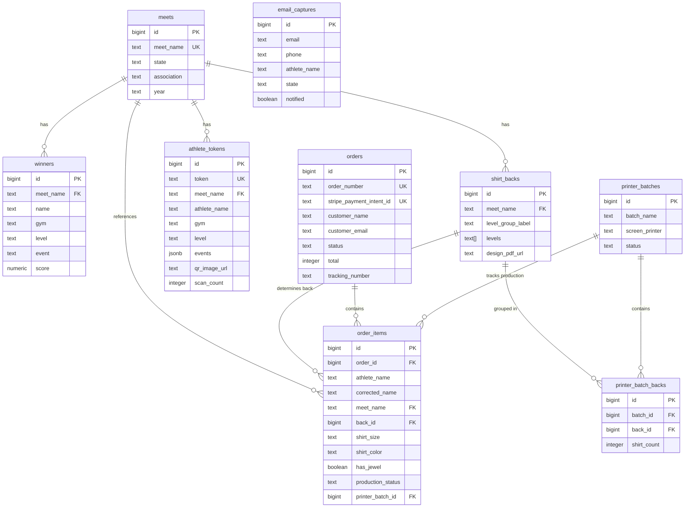

# The State Champion Ordering System

## Enhancement Summary

**Deepened on:** 2026-03-27
**Review agents used:** Architecture Strategist, Security Sentinel, Performance Oracle, Supabase Guardian, Data Integrity Guardian, Best Practices Researcher, Learnings Researcher, Framework Docs Researcher

### Critical Findings (Must Fix Before Implementation)

1. **`publish_meet` CASCADE DELETE will destroy order data.** The existing RPC deletes the `meets` row and cascades to all child tables. New tables (`shirt_backs`, `athlete_tokens`, `order_items`) would be destroyed on every meet re-processing. **Fix:** Redesign `publish_meet` to update `meets` in place and only delete/reinsert `results` and `winners`. New ordering tables are never touched by republish.

2. **RLS policies on `orders`/`order_items` are too permissive.** `USING (true)` exposes all customer PII (names, emails, addresses) to any authenticated user, including the Electron app's anon key which is hardcoded in the distributed binary. **Fix:** Use `USING (false)` on orders/order_items; server-side code uses service role (bypasses RLS).

3. **`meet_name` TEXT as FK is fragile.** Meet name normalization is a known P1 blocker. Adding 6 more tables with `meet_name` FKs multiplies the blast radius. **Fix:** New ordering tables should reference `meets.id` (bigint PK) instead of `meet_name`.

4. **`athlete_tokens` CASCADE DELETE destroys printed QR codes.** Physical QR codes mailed to gyms become dead links on meet re-processing. **Fix:** `athlete_tokens` must use `ON DELETE RESTRICT`, not CASCADE. Tokens are immutable once created.

### Security Findings

5. **Drop or restrict `exec_query` RPC.** The existing function accepts arbitrary SQL as SECURITY DEFINER. With public-read RLS changes, anyone with the anon key can read all orders, customer PII, and auth data. **Phase 1 blocker.**

6. **COPPA compliance required.** Athletes are minors. System needs privacy policy, `noindex` on celebration pages, server-side token lookup (not public table access), and legal review.

7. **Rate limiting is mandatory.** All public endpoints need rate limiting via Upstash — email capture, checkout, athlete lookup, admin login. Not optional.

8. **Admin MFA required.** Admin accounts access customer PII and financial data. Enforce TOTP-based MFA.

### Key Performance Optimizations

9. **Add indexes for cascading dropdown.** No index exists on `winners(state, gym, name)`. Without it, every dropdown interaction is a full table scan of 22,000+ rows.

10. **Cache celebration pages with ISR.** Athlete data is immutable — use Next.js Incremental Static Regeneration. First request hits Supabase; all subsequent requests serve from Vercel edge cache.

11. **Enable Supabase Supavisor connection pooling.** Email blasts create burst traffic (6,700 parents in one hour). Default 60-connection pool will be exhausted.

12. **Async webhook processing.** Move email sending and EasyPost order creation out of the Stripe webhook handler into a background queue. Keeps webhook fast (<200ms), prevents Stripe timeouts.

13. **Code-split celebration animations.** Load only the specific event animation needed (not all 5). Use `motion/mini` (~5KB) instead of full Framer Motion (~32KB). Server-render athlete name first for instant display on slow connections.

### Data Integrity Improvements

14. **Make `shirt_backs` append-only with versioning.** Orders reference immutable `shirt_backs.id` values. Republishing creates new rows rather than replacing.

15. **Add `order_status_history` audit table.** Financial system needs to track who changed status and when — not just the current status.

16. **Use PostgreSQL sequence for `order_number`.** Prevents duplicate order numbers under concurrent Stripe webhooks.

17. **Add unique constraint on `email_captures(email, athlete_name, state)`.** Prevents duplicate email signups from page refreshes.

18. **Status transition constraints.** Prevent backward status transitions (e.g., `returned` → `queued`) with database triggers.

---

## Overview

Build a complete, integrated ordering system at **thestatechampion.com** that replaces the current PayPal + paper-based workflow with a modern Stripe-powered, fully digital system. This is the rebrand launch — the first impression of the new CHP operation — and needs to deliver "shock and awe."

The system spans three domains:
1. **Customer-facing website** — athlete lookup, personalized celebration animations, ordering + Stripe checkout
2. **Admin dashboard** — order management, screen printer batching, EasyPost shipping, team access
3. **Physical artifact generation** — per-athlete QR codes on order forms (mailed to gyms via existing Electron app)

**Scale**: ~69 states × ~325 winners/state × 30% conversion ≈ 6,700+ orders/season, growing.

## Problem Statement

The current ordering process is a nightmare:
- PayPal-only payments (no modern checkout, no metadata)
- Paper order forms mailed to gyms, hoping they get distributed
- After orders come in: printing, highlighting, photocopying, manual tracking
- No clean way to group orders by shirt back for the screen printer
- No automated shipping label generation
- No way to capture demand from athletes who find CHP via ads but whose results aren't processed yet

Every step is manual, error-prone, and doesn't scale to 69 states.

## Proposed Solution

### Tech Stack

| Layer | Technology | Why |
|-------|-----------|-----|
| **Framework** | Next.js 15 (App Router) | React (familiar from Electron app), server components, API routes for webhooks, great Vercel deployment |
| **Hosting** | Vercel | Zero-config Next.js deployment, edge functions, automatic HTTPS, preview deploys |
| **Database** | Supabase (PostgreSQL) | Already the source of truth for meet results. Add order tables alongside. RLS for security. |
| **Payments** | Stripe (Payment Intents + Elements) | Industry standard, custom checkout UI, webhooks, dashboard for refunds |
| **Shipping** | EasyPost | API-first, 120K free labels/year (6,700 fits easily), 1,000 shipments/batch, webhook-driven. Best API quality of all shipping platforms. ~$0 for labels + postage at negotiated USPS rates |
| **Email** | Postmark | Best deliverability in the industry (99%+ inbox, sub-1s delivery). Separate transactional + broadcast streams. ~$200-250/year. React Email rendered to HTML. |
| **Animations** | Framer Motion | React-native animation library, perfect for celebration page transitions. No Lottie dependency. |
| **QR Codes** | `qrcode` npm package | Server-side generation, embed in PDFs. Simple, reliable. |

### Architecture Diagram

```
┌─────────────────────────────────────────────────────────────────┐
│                    thestatechampion.com (Vercel)                 │
│                                                                 │
│  ┌──────────────┐  ┌──────────────┐  ┌───────────────────────┐  │
│  │ Public Pages  │  │ Order Flow   │  │ Admin Dashboard       │  │
│  │ - Landing     │  │ - Athlete    │  │ - Orders by Back      │  │
│  │ - Lookup      │  │   lookup     │  │ - Printer Batches     │  │
│  │ - Celebrate   │  │ - Cart       │  │ - Shipping Queue      │  │
│  │              │  │ - Checkout   │  │ - Stats/Revenue       │  │
│  └──────────────┘  └──────┬───────┘  └───────────┬───────────┘  │
│                           │                      │               │
└───────────────────────────┼──────────────────────┼───────────────┘
                            │                      │
              ┌─────────────┼──────────────────────┼─────────┐
              │             ▼                      ▼         │
              │        ┌─────────┐          ┌──────────┐     │
              │        │ Stripe  │          │ Supabase │     │
              │        │ Payment │          │ Auth     │     │
              │        │ Intents │          │ (Admin)  │     │
              │        └────┬────┘          └──────────┘     │
              │             │                                │
              │             ▼                                │
              │   ┌───────────────────┐                      │
              │   │    Supabase DB    │                      │
              │   │                   │                      │
              │   │ meets ◄───── Electron App publishes      │
              │   │ results           │                      │
              │   │ winners           │                      │
              │   │ ─────────────     │                      │
              │   │ orders (NEW)      │                      │
              │   │ order_items (NEW) │                      │
              │   │ shirt_backs (NEW) │                      │
              │   │ athlete_tokens    │                      │
              │   │ email_captures    │                      │
              │   │ printer_batches   │                      │
              │   └───────────────────┘                      │
              │             │                                │
              │    ┌────────┴────────┐                       │
              │    ▼                 ▼                        │
              │ ┌──────────┐  ┌──────────┐                   │
              │ │ EasyPost │  │ Postmark │                   │
              │ │(labels)   │  │(email)   │                   │
              │ └──────────┘  └──────────┘                   │
              └──────────────────────────────────────────────┘
```

## Technical Approach

### Pre-Requisite: Redesign `publish_meet` RPC

> **CRITICAL**: Before any ordering tables are created, the existing `publish_meet` RPC must be redesigned. The current implementation deletes the `meets` row and cascades to all child tables. With ordering tables in place, this would destroy paid orders, printed QR codes, and printer batch records on every meet re-processing.

**New approach (`publish_meet_v2`):**
1. **UPSERT the `meets` row** instead of DELETE + INSERT. The `meets.id` is preserved, so no cascades fire.
2. **DELETE + reinsert only `results` and `winners`** (these are reproducible from source data).
3. **Never touch `shirt_backs`, `athlete_tokens`, `orders`, or `order_items`.**
4. If level groupings change on re-processing, create NEW `shirt_backs` rows (append-only, versioned) and flag affected `order_items` for admin review.
5. If an athlete is removed from winners on re-processing, their `athlete_tokens` and QR codes remain valid (the celebration page shows "results updated" instead of 404).

```sql
-- Simplified publish_meet_v2 approach:
-- 1. UPSERT meets (preserves id, updates metadata)
INSERT INTO public.meets (meet_name, state, association, year, ...)
VALUES (...)
ON CONFLICT (meet_name) DO UPDATE SET
    state = EXCLUDED.state,
    version = meets.version + 1,
    published_at = NOW();

-- 2. Replace results and winners only (scoped delete, not cascading from meets)
DELETE FROM public.results WHERE meet_name = p_meet_name;
DELETE FROM public.winners WHERE meet_name = p_meet_name;
INSERT INTO public.results (...) SELECT ... FROM jsonb_array_elements(p_results);
INSERT INTO public.winners (...) SELECT ... FROM jsonb_array_elements(p_winners);

-- 3. shirt_backs, athlete_tokens, orders, order_items are UNTOUCHED
```

### Database Schema (New Supabase Tables)

```sql
-- ============================================================
-- SHIRT BACKS: Maps level groups to back designs per meet
-- Populated by Electron app when processing a meet
-- ============================================================
CREATE TABLE shirt_backs (
    id BIGINT GENERATED ALWAYS AS IDENTITY PRIMARY KEY,
    meet_id BIGINT NOT NULL REFERENCES meets(id) ON DELETE RESTRICT,  -- Use ID, not meet_name
    meet_name TEXT NOT NULL,              -- Denormalized for display (not FK)
    level_group_label TEXT NOT NULL,      -- "Levels 3-5", "XCEL"
    levels TEXT[] NOT NULL,               -- {"3","4","5"} or {"Bronze","Silver","Gold"}
    design_pdf_url TEXT,                  -- Supabase Storage URL to back design PDF
    version INTEGER NOT NULL DEFAULT 1,   -- Append-only: new version on re-processing
    superseded_at TIMESTAMPTZ,            -- NULL = current version; set when replaced
    created_at TIMESTAMPTZ DEFAULT NOW()
);
-- No unique index on (meet_name, level_group_label) — multiple versions can coexist
CREATE INDEX idx_shirt_backs_meet ON shirt_backs(meet_id, level_group_label) WHERE superseded_at IS NULL;

-- ============================================================
-- ATHLETE TOKENS: Unique tokens for QR code → celebration page
-- Generated when order forms are created
-- ============================================================
CREATE TABLE athlete_tokens (
    id BIGINT GENERATED ALWAYS AS IDENTITY PRIMARY KEY,
    token TEXT UNIQUE NOT NULL,           -- Short UUID for URL
    meet_id BIGINT NOT NULL REFERENCES meets(id) ON DELETE RESTRICT,  -- RESTRICT, not CASCADE — tokens survive re-processing
    meet_name TEXT NOT NULL,              -- Denormalized for display
    athlete_name TEXT NOT NULL,
    gym TEXT NOT NULL DEFAULT '',
    level TEXT NOT NULL,
    division TEXT NOT NULL,
    events JSONB NOT NULL DEFAULT '[]',   -- [{"event":"vault","score":9.875,"is_tie":false}, ...]
    qr_image_url TEXT,                    -- Supabase Storage URL to QR code image
    scan_count INTEGER NOT NULL DEFAULT 0,
    last_scanned_at TIMESTAMPTZ,
    created_at TIMESTAMPTZ DEFAULT NOW()
);
CREATE INDEX idx_athlete_tokens_lookup ON athlete_tokens(meet_name, athlete_name, gym);

-- ============================================================
-- ORDERS: One per checkout transaction
-- ============================================================
CREATE TABLE orders (
    id BIGINT GENERATED ALWAYS AS IDENTITY PRIMARY KEY,
    order_number TEXT UNIQUE NOT NULL,    -- Human-readable: "CHP-2026-00001"
    stripe_payment_intent_id TEXT UNIQUE,

    -- Customer info
    customer_name TEXT NOT NULL,
    customer_email TEXT NOT NULL,
    customer_phone TEXT,

    -- Shipping address
    shipping_name TEXT NOT NULL,
    shipping_address_line1 TEXT NOT NULL,
    shipping_address_line2 TEXT,
    shipping_city TEXT NOT NULL,
    shipping_state TEXT NOT NULL,
    shipping_zip TEXT NOT NULL,

    -- Financials (all amounts in cents, Stripe convention)
    subtotal INTEGER NOT NULL,
    shipping_cost INTEGER NOT NULL,        -- $5.25 first shirt + $2.90 each additional
    tax INTEGER NOT NULL DEFAULT 0,        -- Stripe Tax auto-calculates per state
    total INTEGER NOT NULL,

    -- Status tracking
    status TEXT NOT NULL DEFAULT 'pending'
        CHECK (status IN ('pending','paid','processing','shipped','delivered','refunded','cancelled')),

    -- EasyPost
    easypost_order_id TEXT,
    easypost_shipment_id TEXT,
    tracking_number TEXT,
    carrier TEXT,

    -- Timestamps
    paid_at TIMESTAMPTZ,
    shipped_at TIMESTAMPTZ,
    created_at TIMESTAMPTZ DEFAULT NOW(),
    updated_at TIMESTAMPTZ DEFAULT NOW()
);
CREATE INDEX idx_orders_status ON orders(status);
CREATE INDEX idx_orders_email ON orders(customer_email);

-- Sequence for concurrent-safe order number generation
CREATE SEQUENCE order_number_seq START 1;

-- ============================================================
-- ORDER ITEMS: One per shirt in an order
-- ============================================================
CREATE TABLE order_items (
    id BIGINT GENERATED ALWAYS AS IDENTITY PRIMARY KEY,
    order_id BIGINT NOT NULL REFERENCES orders(id) ON DELETE CASCADE,

    -- What shirt
    athlete_name TEXT NOT NULL,           -- Winner's name as it appears in results
    corrected_name TEXT,                  -- Parent-submitted correction (NULL = no correction needed)
    name_correction_reviewed BOOLEAN DEFAULT FALSE,  -- Admin has reviewed the correction
    meet_id BIGINT NOT NULL REFERENCES meets(id) ON DELETE RESTRICT,  -- Use ID; RESTRICT prevents accidental deletion
    meet_name TEXT NOT NULL,              -- Denormalized for display
    back_id BIGINT NOT NULL REFERENCES shirt_backs(id) ON DELETE RESTRICT,  -- Immutable reference to specific back version

    -- Shirt options
    shirt_size TEXT NOT NULL
        CHECK (shirt_size IN ('YS','YM','YL','S','M','L','XL','XXL')),
    shirt_color TEXT NOT NULL DEFAULT 'white'
        CHECK (shirt_color IN ('white','grey')),
    has_jewel BOOLEAN NOT NULL DEFAULT FALSE,

    -- Price breakdown (cents)
    unit_price INTEGER NOT NULL DEFAULT 2795,  -- $27.95
    jewel_price INTEGER NOT NULL DEFAULT 0,     -- $4.50 = 450 when has_jewel

    -- Production tracking
    production_status TEXT NOT NULL DEFAULT 'pending'
        CHECK (production_status IN ('pending','queued','at_printer','printed','packed')),
    printer_batch_id BIGINT,  -- FK added after printer_batches table

    created_at TIMESTAMPTZ DEFAULT NOW()
);
CREATE INDEX idx_order_items_back ON order_items(back_id, production_status);
CREATE INDEX idx_order_items_order ON order_items(order_id);
-- Covering index for admin backs aggregation (index-only scan for size/color/jewel breakdown)
CREATE INDEX idx_order_items_back_agg ON order_items(production_status, back_id)
    INCLUDE (shirt_size, shirt_color, has_jewel, corrected_name);
-- Covering index for shipping queue anti-join
CREATE INDEX idx_order_items_order_status ON order_items(order_id, production_status);

-- ============================================================
-- PRINTER BATCHES: Track groups of backs sent to screen printer
-- ============================================================
CREATE TABLE printer_batches (
    id BIGINT GENERATED ALWAYS AS IDENTITY PRIMARY KEY,
    batch_name TEXT NOT NULL,             -- "Week of March 27 - Printer 1"
    screen_printer TEXT NOT NULL DEFAULT 'printer_2'
        CHECK (screen_printer IN ('printer_1','printer_2')),
    -- Note: Printer 1 is fully committed to old system. New orders go to Printer 2.
    status TEXT NOT NULL DEFAULT 'queued'
        CHECK (status IN ('queued','at_printer','returned')),
    sent_at TIMESTAMPTZ,
    returned_at TIMESTAMPTZ,
    notes TEXT,
    created_at TIMESTAMPTZ DEFAULT NOW()
);

-- Join table: which backs are in which batch
CREATE TABLE printer_batch_backs (
    id BIGINT GENERATED ALWAYS AS IDENTITY PRIMARY KEY,
    batch_id BIGINT NOT NULL REFERENCES printer_batches(id) ON DELETE CASCADE,
    back_id BIGINT NOT NULL REFERENCES shirt_backs(id),
    shirt_count INTEGER NOT NULL DEFAULT 0,  -- Total shirts for this back in this batch
    UNIQUE(batch_id, back_id)
);

-- Add FK from order_items to printer_batches
ALTER TABLE order_items
    ADD CONSTRAINT fk_order_items_batch
    FOREIGN KEY (printer_batch_id) REFERENCES printer_batches(id);

-- ============================================================
-- EMAIL CAPTURES: For unprocessed meets
-- ============================================================
CREATE TABLE email_captures (
    id BIGINT GENERATED ALWAYS AS IDENTITY PRIMARY KEY,
    email TEXT NOT NULL,
    phone TEXT,                            -- Optional, for future SMS marketing
    athlete_name TEXT NOT NULL,
    state TEXT,
    association TEXT,                      -- "USAG" or "AAU"
    year TEXT DEFAULT '2026',
    gym TEXT,
    level TEXT,
    meet_identifier TEXT,                 -- Best description they can give
    notified BOOLEAN DEFAULT FALSE,
    notified_at TIMESTAMPTZ,
    source TEXT DEFAULT 'website',         -- 'website', 'ad', 'referral'
    created_at TIMESTAMPTZ DEFAULT NOW()
);
CREATE INDEX idx_email_captures_state ON email_captures(state, notified);
-- Prevent duplicate signups from page refreshes
CREATE UNIQUE INDEX idx_email_captures_unique
    ON email_captures(email, athlete_name, COALESCE(state, ''));

-- ============================================================
-- ORDER STATUS HISTORY: Audit trail for financial compliance
-- ============================================================
CREATE TABLE order_status_history (
    id BIGINT GENERATED ALWAYS AS IDENTITY PRIMARY KEY,
    order_id BIGINT NOT NULL REFERENCES orders(id) ON DELETE CASCADE,
    old_status TEXT,
    new_status TEXT NOT NULL,
    changed_by TEXT,                      -- Admin user email or 'system'
    reason TEXT,
    created_at TIMESTAMPTZ DEFAULT NOW()
);
CREATE INDEX idx_order_status_history ON order_status_history(order_id);

-- ============================================================
-- WEBHOOK EVENTS: Idempotency tracking for Stripe/EasyPost
-- ============================================================
CREATE TABLE webhook_events (
    event_id TEXT PRIMARY KEY,            -- Stripe/EasyPost event ID
    event_type TEXT NOT NULL,
    status TEXT DEFAULT 'completed',      -- 'completed' or 'partial'
    processed_at TIMESTAMPTZ DEFAULT NOW()
);

-- ============================================================
-- PERFORMANCE INDEXES: For cascading dropdown and admin views
-- ============================================================
-- Cascading dropdown: state → gym → name lookup
CREATE INDEX idx_winners_state_gym_name ON winners(state, gym, name);
-- Meets lookup: year + association → state
CREATE INDEX idx_meets_year_assoc_state ON meets(year, association, state);

-- ============================================================
-- ADMIN USERS: Team members with dashboard access
-- ============================================================
-- Uses Supabase Auth. Admin users are identified by:
-- 1. Supabase auth.users table (email/password login)
-- 2. A simple admin_users table for role tracking
CREATE TABLE admin_users (
    id UUID PRIMARY KEY REFERENCES auth.users(id),
    name TEXT NOT NULL,
    role TEXT NOT NULL DEFAULT 'admin'
        CHECK (role IN ('admin','shipping','viewer')),
    created_at TIMESTAMPTZ DEFAULT NOW()
);
```

### ERD



### RLS Policies

```sql
-- WINNERS: Public read (for athlete lookup), only Electron app writes
CREATE POLICY "Public can read winners" ON winners
    FOR SELECT USING (true);
-- Existing authenticated insert policy stays for Electron app

-- SHIRT_BACKS: Public read, authenticated insert (Electron)
CREATE POLICY "Public can read backs" ON shirt_backs
    FOR SELECT USING (true);
CREATE POLICY "Authenticated can insert backs" ON shirt_backs
    FOR INSERT WITH CHECK ((SELECT auth.role()) = 'authenticated');

-- ATHLETE_TOKENS: Public read (for celebration pages)
CREATE POLICY "Public can read tokens" ON athlete_tokens
    FOR SELECT USING (true);

-- ORDERS: Deny all non-service access (service role bypasses RLS entirely)
-- This prevents the Electron app's anon key from reading customer PII
CREATE POLICY "Deny public access to orders" ON orders
    FOR ALL USING (false);

-- ORDER_ITEMS: Same defense-in-depth
CREATE POLICY "Deny public access to order items" ON order_items
    FOR ALL USING (false);

-- ADMIN read access (for the admin dashboard — uses Supabase Auth, not service role)
CREATE POLICY "Admins can read orders" ON orders
    FOR SELECT USING ((SELECT auth.uid()) IN (SELECT id FROM admin_users));
CREATE POLICY "Admins can read order items" ON order_items
    FOR SELECT USING ((SELECT auth.uid()) IN (SELECT id FROM admin_users));

-- Note: Order creation and updates happen via service_role key in Next.js API routes.
-- Service role bypasses ALL RLS policies. The policies above only protect against
-- client-side access (browser Supabase client, Electron app anon key).

-- EMAIL_CAPTURES: Public insert (anyone can sign up), admin read
CREATE POLICY "Public can insert captures" ON email_captures
    FOR INSERT WITH CHECK (true);
CREATE POLICY "Admin can read captures" ON email_captures
    FOR SELECT USING ((SELECT auth.uid()) IN (SELECT id FROM admin_users));

-- Note: Orders and order_items use Supabase service role key
-- (server-side only) — never exposed to client. Public users
-- interact via API routes that validate Stripe payment first.
```

### Key User Flows

#### Flow 1: QR Code → Celebration → Order (Primary Path)

```
1. Parent receives gym packet with athlete's order form
2. Scans QR code on order form
3. → thestatechampion.com/celebrate/{token}
4. Celebration animation plays:
   - Event-specific silhouette (vault/bars/beam/floor/AA)
   - Builds to podium moment
   - Athlete's name + achievements appear
   - "Order Your Championship Shirt" CTA
5. → Pre-filled order form:
   - Athlete name (displayed from token)
   - "Is this name spelled correctly?" toggle → correction field if no
   - Events won (displayed, from token)
   - Select: size, color, jewel
   - "Add Another Shirt" (same athlete different size, or different athlete)
6. → Cart review
7. → Shipping address form
8. → Stripe payment (Payment Elements embedded)
9. → Order confirmation page + email
10. → "Create an account to track your order" (optional)
```

#### Flow 1b: Order Status Lookup

```
1. Customer visits thestatechampion.com/order-status
2. Enters order number (CHP-2026-XXXXX) + email
3. → Sees order status, items, tracking number (if shipped)
4. If customer created account: can log in to see all past orders
```

#### Flow 2: Website Browse → Find Athlete → Order

```
1. Parent visits thestatechampion.com
2. Clicks "Find Your Champion" / "Order"
3. Cascading searchable comboboxes (type-to-filter, each filters the next):
   a. Year (default: 2026)
   b. League (USAG / AAU)
   c. State (type to filter — populated from meets for selected year+league)
   d. Gym (type to filter — populated from winners for selected state)
   e. Athlete Name (type to filter — populated from winners for selected gym)
4. Selects athlete → same celebration page → order flow
```

#### Research Insights: Dropdown Performance
- **Single RPC over 5 round trips**: Create a `search_athletes_cascading(p_year, p_association, p_state, p_gym)` RPC that returns the appropriate options for each dropdown level in one call
- **Cache aggressively**: Winners data changes only when a meet is published (weekly). Use React Query / SWR with `staleTime: 5 * 60 * 1000` (5 minutes)
- **Consider static JSON**: At publish time, generate per-state JSON files (15KB each) and serve from Vercel CDN. Eliminates Supabase queries entirely for the lookup flow
- **Debounce type-to-filter**: 300ms debounce on the combobox input to avoid firing a query on every keystroke

#### Flow 3: Unprocessed Meet → Email Capture

```
1. Parent sees geofenced ad at meet → visits site
2. Searches for athlete → no results found for that meet
3. Banner: "We're still processing results from this meet!
   Enter your email and we'll notify you when they're ready."
4. Captures: email, phone (optional), athlete name, state, gym, level
5. → Confirmation: "Got it! We'll email you. Your gym should
   also receive order forms in the mail soon."
6. [Later] Meet processed → email blast to all captures for that state
```

#### Flow 4: Admin → Printer Batching

```
1. Admin logs in → Dashboard overview
   - Orders this week: 142 | Revenue: $4,256
   - Backs with pending orders: 23
   - Batches at printer: 2 (18 backs)
   - Ready to ship: 45 orders
   - ⚠️ Alerts: 3 name corrections pending, 1 payment issue
   - Meet processing status: 12 processed, 4 pending
   - QR scan engagement: 847 scans this week
2. Clicks "Orders by Back" view
   - Grouped list: each back shows count, sizes breakdown, jewel count, status
   - Example: "2026 NV - Levels 3-5" → 34 shirts (8 YM, 12 S, 10 M, 4 L) | 💎 6 jewel
   - Name corrections flagged with ⚠️ icon per back
3. Selects up to 10 backs → "Create Printer Batch"
   - Assigns to Printer 1 or Printer 2
   - Batch name auto-generated: "Week of Mar 27 - Printer 1"
4. Prints batch manifest:
   - List of backs + shirt counts by size/color
   - **Jewel orders clearly marked** (separate section or bold indicator)
   - Name corrections that need to be applied before printing
5. Takes physical shirts + manifest to screen printer
6. Marks batch as "At Printer"
7. [Later] Shirts return → marks batch as "Returned"
   - All order items for those backs update to "printed"
```

#### Flow 5: Admin → Shipping

```
1. Admin clicks "Ready to Ship" view
   - Shows orders where ALL items are "printed"
   - Sorted by date (oldest first)
2. Clicks "Create Shipping Labels" (batch or individual)
   - EasyPost API creates shipment + purchases label
   - Returns label PDF + tracking number (up to 1,000 per batch)
3. Prints: shipping label + custom packing slip (generated by our app)
   - Packing slip shows: athlete name(s), size, color, 💎 jewel indicator, back description
   - Label and packing slip print together, resumable from last position
4. Packs order → marks as "shipped"
5. Customer gets shipping confirmation email with tracking (via Postmark)
```

#### Flow 6: Name Correction Review

```
1. Admin clicks "Alerts" → Name Corrections tab
   - List of order items where parent submitted a corrected name
   - Shows: original name | corrected name | meet | back
2. Admin reviews each correction:
   - "Apply" → updates the back design before printing
   - "Dismiss" → keeps original (parent made a mistake)
3. Corrections applied before batch goes to printer
```

### Personalized Celebration Animations

Five event-specific animations, each following the same template:

```
[3-second sequence]
1. Background: Championship gold/dark gradient
2. Silhouette figure performs event:
   - Vault: running approach → handspring → stick landing
   - Bars: kip → release move → catch → dismount
   - Beam: leap → back tuck → stick
   - Floor: tumbling pass → stick
   - All-Around: montage of all 4 events
3. Figure walks to podium, steps up to #1 position
4. Confetti burst
5. Text reveal: "{Athlete Name}" / "{Event} Champion" / "{Level} • {State} {Year}"
6. CTA button fades in: "Order Your Championship Shirt →"
```

**Implementation**: Framer Motion (React) with SVG silhouettes. Each animation is a reusable component that accepts athlete data as props. No video files — pure code-driven animation for instant loading on mobile.

**SVG Assets Needed**: 5 gymnast silhouette sequences (can be simple — 3-4 keyframes each), podium, confetti particles, star/trophy decorations.

#### Research Insights: Mobile Performance

**Performance budget**: Total JS for celebration page < 50KB gzipped.
- Use `motion/mini` (~5KB) instead of full `framer-motion` (~32KB) for the celebration page
- Code-split: load only the specific event animation needed via `next/dynamic` with `ssr: false`
- Use `canvas-confetti` (4KB, zero deps) for the confetti burst instead of a custom particle system
- Consider pre-made Lottie animations from LottieFiles.com for the gymnast silhouettes (~$5-10 each, use `.lottie` format for 98% smaller than GIF equivalents)

**Critical for gym connectivity (3G/spotty LTE)**:
- Server-render the athlete's name and achievements as HTML first (Next.js server component) — visible instantly
- Animation hydrates on top as progressive enhancement — if JS fails, they still see their name
- Use `<link rel="preload">` for the event-specific SVG/Lottie asset
- Run SVGO on all SVG assets, inline as React components (no external file loads)
- Set `loop={false}` on all animations — one-shot celebration, not continuous battery drain

**Fallback for slow connections**: If animation assets haven't loaded within 2 seconds, show a static congratulations card with confetti CSS animation (pure CSS, zero JS). The CTA button should be visible immediately regardless of animation state.

**Caching**: Use Next.js ISR (Incremental Static Regeneration) for celebration pages. Athlete token data is immutable — cache at the edge with 24-hour revalidation. First request hits Supabase; all subsequent requests serve from Vercel's CDN.

### QR Code Integration with Electron App

The existing `order_form_generator.py` generates per-athlete PDF order forms. Modifications needed:

1. **Before generating order forms**: Create `athlete_tokens` records in Supabase for all winners
   - Token = UUID v4 (unique constraint in DB guarantees no duplicates)
   - Include athlete's events/scores as JSONB for the celebration page
2. **Generate QR code**: Encode `https://thestatechampion.com/celebrate/{token}` using `qrcode` Python library
   - Generate as PNG in memory, upload to Supabase Storage (`qr-codes` bucket)
   - Store URL back in `athlete_tokens.qr_image_url`
3. **Embed in PDF**: Replace the current generic "CHP QR" template image with per-athlete QR codes
4. **Scan tracking**: When celebration page loads, increment `scan_count` and update `last_scanned_at` on the token record. This enables per-meet and per-gym engagement analytics.
5. **Idempotent**: If tokens already exist for a meet's winners (re-processing), reuse existing tokens rather than generating new ones (preserves already-printed QR codes)
6. **File**: `python/core/order_form_generator.py` + new `python/core/qr_generator.py`

### Stripe Integration Details

**Products (pre-created in Stripe Dashboard or via API):**
- Championship T-Shirt: $27.95 (price ID stored in env)
- Jewel Add-On: $4.50 (price ID stored in env)

**Checkout Flow (using Checkout Sessions `ui_mode: 'custom'`):**
1. Client builds cart → sends to `/api/checkout` server action
2. Server creates Stripe Checkout Session with:
   - `ui_mode: 'custom'` (full custom UI control)
   - `line_items` with `price_data` (dynamic pricing, server-calculated)
   - `automatic_tax: { enabled: true }` (Stripe Tax)
   - `shipping_options` with calculated cost ($5.25 first + $2.90 additional)
   - Returns `client_secret` to client
3. Client calls `stripe.initCheckout({ clientSecret })` → renders custom payment form
4. On success → redirect to confirmation page via `return_url`
5. Webhook (`/api/webhooks/stripe`) on `checkout.session.completed`:
   - **Synchronous** (in webhook handler): Create order + order_items in Supabase, check `webhook_events` table for idempotency
   - **Async** (queued via Vercel KV or Inngest): Send confirmation email via Postmark
   - **Async** (queued): EasyPost shipment is NOT created here — only when admin triggers from shipping queue

#### Research Insights: Webhook Best Practices
- Listen for `checkout.session.completed` (not `payment_intent.succeeded`) since we use Checkout Sessions
- Use `request.text()` (NOT `request.json()`) for raw body — required for signature verification in Next.js App Router
- Check `webhook_events` table before processing (idempotency across retries)
- Respond with 200 within 5 seconds — queue heavy operations (email, shipping)
- Stripe retries failed webhooks for 72 hours with exponential backoff
- Test locally with: `stripe listen --forward-to localhost:3000/api/webhooks/stripe`
- On Vercel: disable deployment protection for `/api/webhooks/*` routes

**Stripe Checkout Sessions with `ui_mode: 'custom'`**: As of March 2025, Stripe supports custom UI via Checkout Sessions. This gives us full control over the checkout UI (matching the celebration experience) PLUS built-in handling of tax (Stripe Tax), shipping calculation, and line items. Best of both worlds.

**Stripe Tax**: Auto-calculates and collects correct sales tax per state. $0.50/transaction + 0.5% of volume. ~$4,290/year at current volume. Handles compliance automatically.

**Shipping Cost**: $5.25 for the first shirt, $2.90 for each additional shirt. Calculated server-side.

### EasyPost Integration

**Setup:**
- EasyPost Developer plan (free — 120,000 labels/year, 6,700 fits easily)
- USPS Ground Advantage or Priority Mail (0.5-1 lb packages, best rates for shirts)
- Negotiated rates below USPS Commercial pricing included

**API Flow:**
1. On order paid → Create EasyPost Shipment via API
   - From address (your warehouse), To address (customer)
   - Parcel dimensions for t-shirt package
   - Rate shop across carriers automatically
2. Admin triggers "Purchase Label" → EasyPost purchases + returns label PDF
3. Batch operations: up to 1,000 shipments per batch call
4. Webhook fires on tracking updates → update order status
5. Auto-email customer with tracking via Postmark

**Packing Slips:**
- Generated by our Next.js app (not EasyPost — they don't provide packing slips)
- Custom React PDF template: athlete name(s), size, color, 💎 jewel indicator, back description
- Printed alongside shipping label for each order

### Email Architecture (Postmark)

**Transactional Emails:**
1. **Order Confirmation** — sent on payment success (Stripe webhook)
2. **Shipping Confirmation** — sent when tracking number assigned
3. **Delivery Confirmation** — sent on EasyPost delivery webhook

**Marketing Emails:**
1. **Results Ready** — blast to email_captures when a meet is processed
2. **Gym Notification** — "Your gym will receive order forms soon"

**Templates**: React Email components rendered to HTML via `@react-email/render`, then sent through Postmark API. Transactional emails use Postmark's Transactional Stream; marketing blasts use the separate Broadcast Stream (protects transactional deliverability).

## Project Structure

```
thestatechampion.com/           # New Next.js project (separate repo)
├── src/
│   ├── app/
│   │   ├── page.tsx                     # Landing page
│   │   ├── layout.tsx                   # Root layout
│   │   ├── find/page.tsx                # Cascading athlete lookup
│   │   ├── celebrate/[token]/page.tsx   # Personalized celebration
│   │   ├── order/page.tsx               # Order form + cart
│   │   ├── checkout/page.tsx            # Stripe payment
│   │   ├── confirmation/page.tsx        # Order confirmation
│   │   ├── admin/
│   │   │   ├── layout.tsx               # Admin auth wrapper
│   │   │   ├── page.tsx                 # Dashboard overview
│   │   │   ├── orders/page.tsx          # All orders list
│   │   │   ├── backs/page.tsx           # Orders grouped by back
│   │   │   ├── batches/page.tsx         # Printer batch management
│   │   │   ├── shipping/page.tsx        # Shipping queue
│   │   │   ├── alerts/page.tsx           # Name corrections, payment issues, stuck orders
│   │   │   ├── emails/page.tsx          # Email capture management + blast tool
│   │   │   ├── meets/page.tsx           # Meet processing status (processed vs pending)
│   │   │   ├── analytics/page.tsx       # QR scan rates, conversion, revenue by state
│   │   │   └── settings/page.tsx        # Team management, activity log
│   │   └── api/
│   │       ├── webhooks/
│   │       │   ├── stripe/route.ts      # Stripe webhook handler
│   │       │   └── easypost/route.ts # EasyPost webhook handler
│   │       ├── checkout/route.ts        # Create Payment Intent
│   │       ├── orders/route.ts          # Order CRUD (admin)
│   │       ├── shipping/route.ts        # EasyPost label creation
│   │       └── email-capture/route.ts   # Email signup
│   ├── components/
│   │   ├── ui/                          # Shared UI components
│   │   ├── athlete-lookup.tsx           # Cascading dropdown component
│   │   ├── order-form.tsx               # Shirt configuration form
│   │   ├── cart.tsx                     # Shopping cart
│   │   ├── celebration/
│   │   │   ├── vault-animation.tsx
│   │   │   ├── bars-animation.tsx
│   │   │   ├── beam-animation.tsx
│   │   │   ├── floor-animation.tsx
│   │   │   ├── all-around-animation.tsx
│   │   │   └── podium-reveal.tsx
│   │   └── admin/
│   │       ├── orders-table.tsx
│   │       ├── backs-view.tsx
│   │       ├── batch-manager.tsx
│   │       ├── shipping-queue.tsx
│   │       ├── name-corrections.tsx     # Review + apply name corrections
│   │       ├── global-search.tsx        # Search across orders, customers, athletes
│   │       └── activity-log.tsx         # Who did what when
│   ├── lib/
│   │   ├── supabase/
│   │   │   ├── client.ts                # Browser client
│   │   │   ├── server.ts                # Server client (service role)
│   │   │   └── types.ts                 # Generated types
│   │   ├── stripe.ts                    # Stripe client + helpers
│   │   ├── easypost.ts                  # EasyPost API client (@easypost/api)
│   │   ├── postmark.ts                  # Email client (postmark npm package)
│   │   ├── packing-slip.ts             # Custom packing slip PDF generation
│   │   └── utils.ts
│   └── emails/                          # React Email templates
│       ├── order-confirmation.tsx
│       ├── shipping-confirmation.tsx
│       └── results-ready.tsx
├── public/
│   ├── animations/                      # SVG assets for celebrations
│   └── images/
├── supabase/
│   └── migrations/
│       └── 002_ordering_schema.sql      # New tables
├── .env.local                           # Stripe, Supabase, EasyPost, Postmark keys
├── next.config.js
├── tailwind.config.ts
├── tsconfig.json
└── package.json
```

## Implementation Phases

### Phase 1: Foundation (Days 1-2)

**Goal**: Next.js project running, connected to Supabase, basic routing.

- [ ] Initialize Next.js 15 project with App Router, TypeScript, Tailwind CSS
- [ ] Configure Supabase client (browser + server)
- [ ] Run migration 002: create all new tables (orders, order_items, shirt_backs, athlete_tokens, email_captures, printer_batches, printer_batch_backs, admin_users)
- [ ] Set up RLS policies (public read on winners/backs/tokens, `USING(false)` on orders/order_items, admin read via admin_users)
- [ ] **Redesign `publish_meet` RPC** → `publish_meet_v2` (UPSERT meets, scoped delete for results/winners only)
- [ ] **Migrate existing RLS policies** on meets/results/winners from `authenticated`-only to public read (required for website)
- [ ] Create Stripe account for CHP, get API keys, enable Stripe Tax
- [ ] Set up Postmark account, verify domain (thestatechampion.com), create Transactional + Broadcast streams
- [ ] Set up EasyPost Developer account, get API keys
- [ ] **Enable Supabase Supavisor connection pooling** (transaction mode) for burst traffic
- [ ] Basic page routing structure (all pages as stubs)
- [ ] Deploy to Vercel (**Pro plan** — need 1,000 concurrent executions for email blast bursts), connect domain

**Key files**: `002_ordering_schema.sql`, `publish_meet_v2.sql`, `lib/supabase/client.ts`, `lib/supabase/server.ts`, `next.config.js`

### Phase 2: Customer Ordering Flow (Days 2-4)

**Goal**: A customer can find their athlete, see their achievements, and order a shirt.

- [ ] **Athlete Lookup** (`find/page.tsx`): Cascading searchable comboboxes (type-to-filter) querying Supabase winners table
  - Year → filters meets (Headless UI or Radix Combobox)
  - League (USAG/AAU) → filters meets.association
  - State → type-to-filter, populated from meets for selected year+league
  - Gym → type-to-filter, populated from winners for selected state
  - Name → type-to-filter, populated from winners for selected gym
  - Each selection re-queries Supabase with accumulated filters
- [ ] **Celebration Page** (`celebrate/[token]/page.tsx`): Load athlete data from token, play animation, CTA to order
- [ ] **Animations**: Build 5 Framer Motion animation components (vault, bars, beam, floor, AA)
  - SVG silhouette keyframe sequences
  - Podium reveal with athlete name/details
  - Confetti particle system
  - Mobile-optimized (test on phone)
- [ ] **Order Form** (`order/page.tsx`): Pre-filled athlete info, shirt configuration
  - Name verification: "Is this name spelled correctly?" → correction field if no
  - Size selector (YS, YM, YL, S, M, L, XL, XXL)
  - Color selector (white, grey)
  - Jewel toggle (+$4.50)
  - "Add Another Shirt" button (same or different athlete)
  - Running total
  - Note: Placeholder design for v1 — will be redesigned later
- [ ] **Cart** state management (React context or Zustand)
- [ ] **Email Capture** for unprocessed meets: detect when lookup returns no results, show capture form
  - Captures: email, phone (optional), athlete name, state, gym, level
  - Source tracking (website, ad, referral)

**Key files**: `components/athlete-lookup.tsx`, `components/celebration/*.tsx`, `components/order-form.tsx`, `app/celebrate/[token]/page.tsx`, `app/find/page.tsx`, `app/order/page.tsx`

### Phase 3: Payments + Order Creation (Days 4-5)

**Goal**: Customer can pay with Stripe and order is recorded.

- [ ] **Stripe setup**: Install `@stripe/stripe-js` + `@stripe/react-stripe-js` + `stripe` (server)
- [ ] **Checkout page** (`checkout/page.tsx`): Shipping address form + Stripe Payment Element
- [ ] **Payment Intent creation** (`api/checkout/route.ts`):
  - Receive cart items, calculate total server-side
  - Create Stripe Payment Intent with order metadata
  - Return client secret
- [ ] **Stripe webhook** (`api/webhooks/stripe/route.ts`):
  - Verify signature
  - On `payment_intent.succeeded`: create order + order_items in Supabase
  - Generate order_number (CHP-2026-XXXXX)
  - Send confirmation email via Postmark
- [ ] **Confirmation page** (`confirmation/page.tsx`): Order summary, tracking info TBD
- [ ] **Order confirmation email** template (React Email + Postmark)

**Key files**: `lib/stripe.ts`, `api/webhooks/stripe/route.ts`, `api/checkout/route.ts`, `app/checkout/page.tsx`, `emails/order-confirmation.tsx`

### Phase 4: Admin Dashboard (Days 5-7)

**Goal**: Team can log in, view orders, manage printer batches, and initiate shipping.

- [ ] **Admin auth**: Supabase Auth email/password login for admin team
  - Middleware to protect `/admin/*` routes
  - `admin_users` table check on login
- [ ] **Dashboard overview** (`admin/page.tsx`):
  - Total orders, revenue, orders by status
  - Backs with pending orders count
  - Active printer batches
  - Shipping queue count
  - Alerts: name corrections pending, payment issues, stuck orders
  - Meet processing status: processed vs pending
  - QR scan engagement metrics
- [ ] **Orders view** (`admin/orders/page.tsx`):
  - Sortable table: order number, customer, date, total, status, items count
  - Click to expand: full order details, items, shipping info
  - **Highly flexible filtering**: by status, state, gym, date range, back, meet, has-jewel, has-name-correction
  - **Sorting**: by any column (date, total, customer, state, etc.)
  - Search by name, email, order number, gym
- [ ] **Orders by Back view** (`admin/backs/page.tsx`):
  - Group all order items by back (meet + level group)
  - For each back: total shirts, breakdown by size/color, **jewel count**, status
  - Name corrections flagged per back (must review before printing)
  - Select backs → "Create Printer Batch" action
  - Visual indicator: backs with enough orders to justify printing
- [ ] **Printer Batch management** (`admin/batches/page.tsx`):
  - List active batches with status (queued/at_printer/returned)
  - Print batch manifest: backs list + size counts per back + **jewel orders clearly marked**
  - Status transitions: queued → at_printer → returned
  - On "returned": update all order_items to "printed"
- [ ] **Alerts/Name Corrections** (`admin/alerts/page.tsx`):
  - Name corrections submitted by parents: original vs corrected, per back
  - Review + apply or dismiss each correction
  - Must be reviewed before back goes to printer
- [ ] **Shipping queue** (`admin/shipping/page.tsx`):
  - Orders where ALL items are "printed" and order not yet shipped
  - "Create Label" button → EasyPost API
  - "Print Label + Packing Slip" button
  - Batch actions for multiple orders
- [ ] **Global search**: Search across orders, customers, athletes from any admin page
- [ ] **CSV export**: Export any view (orders, backs, batches) to CSV
- [ ] **Activity log** (`admin/settings/page.tsx`): Who did what when (important with 2-4 team members)

**Key files**: `app/admin/layout.tsx`, `app/admin/page.tsx`, `app/admin/backs/page.tsx`, `app/admin/batches/page.tsx`, `app/admin/shipping/page.tsx`, `app/admin/alerts/page.tsx`, `components/admin/*.tsx`

### Phase 5: Shipping Integration (Days 7-8)

**Goal**: Shipping labels auto-created via EasyPost, tracking numbers flow back.

- [ ] **EasyPost account setup** (Developer plan — free, 120K labels/year) + API key configuration
- [ ] **EasyPost client** (`lib/easypost.ts`): Create shipment, buy label, batch operations, tracking
  - Install `@easypost/api` Node.js SDK
  - Configure USPS Ground Advantage / Priority Mail as default carrier
- [ ] **Shipment creation**: Admin triggers from shipping queue → EasyPost creates shipment + buys label
  - Rate shop across carriers automatically
  - Batch up to 1,000 shipments per API call
- [ ] **Custom packing slips** (`lib/packing-slip.ts`): Generate PDF with `@react-pdf/renderer`
  - Athlete name(s), corrected name if applicable, size, color, jewel indicator, back description
- [ ] **Tracking webhook** (`api/webhooks/easypost/route.ts`): Update order status on ship/deliver
- [ ] **Shipping confirmation email**: Triggered on tracking number assignment (Postmark transactional stream)
- [ ] **Print flow**: Label PDF (from EasyPost) + packing slip PDF (our app) rendered together, resumable from last position

**Key files**: `lib/easypost.ts`, `api/shipping/route.ts`, `api/webhooks/easypost/route.ts`, `emails/shipping-confirmation.tsx`

### Phase 6: QR Codes + Electron Integration (Days 8-9)

**Goal**: Electron app generates personalized QR codes on order forms.

- [ ] **Python QR generator** (`python/core/qr_generator.py`):
  - For each winner: create `athlete_tokens` record in Supabase (UUID v4 token, unique constraint prevents duplicates)
  - Include athlete's events/scores as JSONB for celebration page
  - Generate QR code image encoding `https://thestatechampion.com/celebrate/{token}`
  - Upload QR image to Supabase Storage (`qr-codes` bucket), store URL in `athlete_tokens.qr_image_url`
  - Idempotent: reuse existing tokens if meet is re-processed (preserves already-printed QR codes)
- [ ] **Modify order_form_generator.py**: Replace static "CHP QR" image with per-athlete QR
- [ ] **Publish shirt_backs to Supabase**: When Electron processes a meet, also publish the level group → back mapping
- [ ] **Scan tracking**: Celebration page increments `scan_count` and updates `last_scanned_at` on token record
- [ ] **Test end-to-end**: Process meet → generate order forms with QR → scan QR → celebration → order

**Key files**: `python/core/qr_generator.py`, `python/core/order_form_generator.py`, Electron app's Supabase publish flow

### Phase 7: Email Marketing + Polish (Days 9-10)

**Goal**: Email capture blasts work, landing page is polished, system is production-ready.

- [ ] **Email blast system**: Admin can select email captures by state → send "Results Ready" email
- [ ] **Results-ready email template** (React Email)
- [ ] **Landing page** (`page.tsx`): Hero section, how it works, trust signals
- [ ] **Mobile optimization**: Test all flows on phone (primary use case for QR scans)
- [ ] **Error handling**: Stripe payment failures, network errors, out-of-stock scenarios
- [ ] **Loading states + optimistic UI** throughout
- [ ] **SEO basics**: Meta tags, Open Graph for sharing
- [ ] **Final Vercel deploy + DNS cutover** for thestatechampion.com

**Key files**: `app/page.tsx`, `emails/results-ready.tsx`, `app/admin/emails/page.tsx`

## System-Wide Impact

### Interaction Graph

- **Stripe payment** → webhook → creates order in Supabase → creates EasyPost order → sends confirmation email
- **Admin marks batch returned** → updates all order_items to "printed" → orders become eligible for shipping
- **EasyPost ships** → webhook → updates order status → sends tracking email to customer
- **Electron publishes meet** → creates winners + shirt_backs + athlete_tokens → enables ordering for that meet
- **Email capture** → stored in Supabase → admin triggers blast when meet is processed

### Error Propagation

- **Stripe webhook fails**: Stripe retries for up to 72 hours with exponential backoff. Idempotent handler checks `webhook_events` table before processing (not just `stripe_payment_intent_id` unique constraint — handles partial failures too).
- **EasyPost API down**: Orders stay in "ready to ship" queue. Admin can retry. No data loss.
- **Supabase down**: Celebration pages served from Vercel ISR cache (no DB hit needed). New orders fail — Stripe payment succeeds but webhook fails → Stripe retries when Supabase recovers.
- **Email send fails**: Queued async from webhook handler. Retried automatically. Admin can resend from dashboard. Non-blocking to order flow.
- **Meet re-processed after orders**: `publish_meet_v2` preserves `meets.id` and all ordering tables. `shirt_backs` are append-only — old versions kept, new versions created. Affected order items flagged for admin review via `order_alerts`.

### State Lifecycle Risks

- **Partial payment**: Stripe Payment Intent created but not completed → order stays in "pending" → auto-expire after 24h
- **Order items across multiple backs**: Some backs may go to printer before others. Order ships only when ALL items are "printed". Admin dashboard shows partially-complete orders distinctly.
- **Meet republished after orders placed**: shirt_backs may change. Need to flag affected orders for manual review rather than silently breaking back_id references.

### Security Considerations

**Payment Security:**
- **Stripe webhook signature verification**: Mandatory. Use `request.text()` (not `.json()`) for raw body. Never trust unverified webhook payloads.
- **EasyPost webhook signature verification**: Also mandatory. Verify `X-Hmac-Signature` header using `client.Webhook.validateWebhook()`.
- **Price calculation server-side**: Client sends ONLY item identifiers (token, size, color, jewel boolean). Server looks up prices. Client NEVER sends prices.
- **Stripe metadata**: Don't store full order details in Stripe metadata (500-char limit). Store cart server-side, reference by ID in Stripe metadata.

**Data Access Security:**
- **Supabase service role key**: Only used server-side. Add `import "server-only"` guard in `lib/supabase/server.ts` to prevent accidental client-side bundling.
- **RLS on orders/order_items**: `USING(false)` denies all non-service access. Admin reads via admin_users check. Service role bypasses RLS entirely.
- **`exec_query` RPC MUST BE RESTRICTED**: The existing `exec_query` function in migration 002 runs as SECURITY DEFINER and accepts arbitrary SQL. With public-read RLS changes, this becomes a full data exfiltration vector. **Drop it or restrict to admin-only before ordering tables go live.**
- **RLS on ALL new tables**: Every new table needs `ALTER TABLE ... ENABLE ROW LEVEL SECURITY` explicitly. Missing RLS = fully open table.
- **Missing RLS on printer_batches/printer_batch_backs**: These need admin-only policies.

**Authentication:**
- **Admin MFA**: Mandatory for all admin accounts (Supabase Auth supports TOTP). Admins access customer PII and financial data.
- **Admin session timeout**: 8 hours max, 30 minutes idle lockout.
- **Rate limiting**: MANDATORY (not optional) on all public endpoints via Upstash + Vercel Edge Middleware:
  - Email capture: 5/hour per IP + CAPTCHA (Cloudflare Turnstile)
  - Checkout: 10/min per IP
  - Athlete lookup: 60/min per IP
  - Admin login: 5/min per IP
  - Order status lookup: 10/min per IP

**Privacy (COPPA):**
- Athletes are minors. System displays children's names, gyms, scores on celebration pages.
- Add `noindex` meta tags to celebration pages (prevent search engine indexing of children's names).
- Add privacy policy addressing children's data before launch.
- Athlete tokens: remove blanket public SELECT policy. Use server-side API route for token lookup instead of exposing full table via Supabase REST API.
- Consult COPPA-specialized attorney before launch.

**Input Validation:**
- Define Zod schemas for every API route input (checkout, email capture, order lookup, name corrections).
- Sanitize `corrected_name`: strip HTML, allow only name characters (alpha, hyphens, apostrophes, spaces, accents), max 100 chars.
- Validate shipping address: ZIP format, valid US state codes, max field lengths.
- Add `Content-Security-Policy` headers in `next.config.js` (allow Stripe domains, block inline scripts).

**Infrastructure:**
- Add `NOTIFY pgrst, 'reload schema'` at end of migration 002 (PostgREST won't see new tables without it).
- Use non-sequential order numbers with random component (`CHP-2026-A7K3F`) to prevent enumeration.
- Add `updated_at` trigger on orders table (auto-set on UPDATE).
- Add GIN index on `shirt_backs.levels` for array lookups.

## Acceptance Criteria

### Customer Experience
- [ ] Customer can find their athlete via searchable cascading comboboxes in <5 seconds
- [ ] QR code scans lead to personalized celebration animation
- [ ] All 5 event animations work smoothly on mobile
- [ ] Customer can flag name spelling corrections during ordering
- [ ] Customer can order multiple shirts (same/different athletes) in one checkout
- [ ] Stripe payment processes successfully with confirmation email
- [ ] Email capture works for unprocessed meets (email + optional phone) with follow-up blast capability

### Admin Dashboard
- [ ] Admin team (2-4 people) can log in with email/password
- [ ] Dashboard shows order counts, revenue, alerts, QR engagement, and pending work at a glance
- [ ] Alerts tab shows name corrections, payment issues, stuck orders
- [ ] Orders can be viewed chronologically and filtered by status
- [ ] Orders can be grouped by back for printer batching, with jewel counts and name corrections visible
- [ ] Printer batches can be created (max 10 backs), tracked through lifecycle, with jewel orders clearly marked
- [ ] Shipping labels generated via EasyPost with tracking numbers
- [ ] Custom packing slips generated by our app (athlete names, sizes, jewel indicator)
- [ ] Labels + packing slips print together, resumable from last position
- [ ] Global search across orders, customers, athletes
- [ ] CSV export for any view
- [ ] Activity log tracking who did what when

### Integrations
- [ ] Stripe payments process correctly with webhook-based order creation
- [ ] EasyPost creates labels and returns tracking numbers
- [ ] Postmark sends transactional emails (confirmation, shipping, delivery)
- [ ] Email blasts work for results-ready notifications

### Data Integrity
- [ ] Order totals calculated server-side (no price manipulation)
- [ ] Idempotent Stripe webhook handler (no duplicate orders)
- [ ] RLS prevents public write access to results/winners/meets tables
- [ ] Order items correctly linked to shirt_backs via level lookup
- [ ] Meet republication flags affected orders for review

### Physical Integration
- [ ] Electron app generates per-athlete QR codes on order forms
- [ ] QR codes encode correct celebration page URLs
- [ ] shirt_backs data published to Supabase during meet processing
- [ ] athlete_tokens created for all winners during order form generation

## Dependencies & Risks

### Dependencies
1. **Supabase reliability** — winners data must be in Supabase before ordering works. Currently "still working on reliability."
2. **Stripe account creation** — new account for CHP needs verification (can take 1-2 days)
3. **EasyPost account** — sign up + configure carrier accounts
4. **Postmark domain verification** — DNS TXT records for thestatechampion.com
5. **DNS access** — need to point thestatechampion.com to Vercel + add Postmark DNS records
6. **SVG gymnast assets** — 5 event silhouette sequences needed for animations
7. **Existing order form template** — QR code placement needs to fit within current design

### Risks
| Risk | Likelihood | Impact | Mitigation |
|------|-----------|--------|------------|
| `publish_meet` destroys order data | **Certain** (if not fixed) | **Critical** | Redesign to `publish_meet_v2` (UPSERT meets, scoped delete) — **Phase 1 blocker** |
| Supabase winners data not reliable yet | Medium | High | Can launch with manually verified meets first |
| Burst traffic from email blasts | High | Medium | ISR caching, Supavisor pooling, async webhook processing, Vercel Pro |
| Timeline too aggressive | High | Medium | Core ordering can work without animations; prioritize Stripe + admin |
| EasyPost API complexity | Low | Medium | Well-documented API, Node.js SDK |
| Celebration animations too slow on mobile | Medium | Medium | Code-split, motion/mini, server-render name first, static fallback |
| Screen printer workflow doesn't map cleanly | Low | High | Close collaboration with printer on batch format |
| COPPA compliance for minors' data | Medium | High | Minimize PII in public pages; celebration page shows only name + achievements (already public competition data) |

## Success Metrics

- **Conversion rate**: Maintain or exceed 30% (current rate)
- **Order processing time**: < 5 minutes from payment to EasyPost order (automated)
- **Admin time per order**: < 30 seconds (vs current manual process)
- **Printer batch creation**: < 2 minutes to create a batch of 10 backs
- **Shipping label creation**: < 1 minute per batch
- **Zero missed orders**: Every paid order tracked through to delivery
- **Customer satisfaction**: Celebration animation creates positive first impression + social sharing

## Monthly Cost Estimate (at 6,700 orders/season)

| Service | Monthly Cost | Notes |
|---------|-------------|-------|
| **Stripe** | ~$1,100/mo during season | 2.9% + $0.30/transaction |
| **Stripe Tax** | ~$360/mo during season | $0.50/transaction + 0.5% volume |
| **USPS Postage** | ~$7,500/mo during season | ~$4.50/package × 1,675/month (4-month season) |
| **EasyPost** | ~$0 | Free tier (120K labels/year) + ~$17/mo tracking |
| **Postmark** | ~$17/mo | Pro plan, ~23K emails/season |
| **Supabase** | $25/mo | Pro plan (connection pooling, 8GB DB) |
| **Vercel** | $20/mo | Pro plan (1,000 concurrent executions) |
| **Total platform** | **~$62/mo** | Excluding Stripe % and postage |
| **Total with Stripe + postage** | **~$9,000/mo** | During active 4-month season |

**Revenue at 30% conversion**: 69 states × 325 winners × 30% × $27.95 = ~$188K/season. Platform costs are <5% of revenue.

## Future Considerations

- **Inventory tracking**: Track blank shirt stock by size/color
- **Analytics dashboard**: Conversion funnel, revenue by state, popular sizes
- **Automated reorder notifications**: When shirt stock runs low
- **Social sharing**: "Share your championship moment" from celebration page
- **Geofence ad integration**: Connect Meta/Google Ads leads directly to email capture
- **Multi-season data**: Year-over-year comparison for business growth
- **Bulk order discounts**: Gym-level ordering with quantity discounts
- **Custom front designs**: If front-of-shirt ever varies

## Sources & References

### Internal References
- Supabase schema: `supabase/migrations/001_initial_schema.sql`
- Order form generator: `python/core/order_form_generator.py`
- Layout engine (back grouping): `python/core/layout_engine.py`
- PDF generator (back design): `python/core/pdf_generator.py`
- IDML generator: `python/core/idml_generator.py`
- Existing QR template: `python/core/templates/CHP QR.png`
- Agent loop (meet processing): `src/main/agent-loop.ts`

### External References
- Stripe Payment Intents: https://stripe.com/docs/payments/payment-intents
- Stripe React Elements: https://stripe.com/docs/stripe-js/react
- EasyPost API: https://docs.easypost.com/
- EasyPost Batch Guide: https://docs.easypost.com/guides/batches-guide
- EasyPost Node.js SDK: https://github.com/EasyPost/easypost-node
- Postmark API: https://postmarkapp.com/developer
- Postmark Broadcast Streams: https://postmarkapp.com/message-streams
- React Email: https://react.email/docs
- @react-pdf/renderer: https://react-pdf.org/
- Framer Motion: https://www.framer.com/motion/
- Next.js App Router: https://nextjs.org/docs/app
- Supabase Auth: https://supabase.com/docs/guides/auth
- Supabase RLS: https://supabase.com/docs/guides/auth/row-level-security
- Headless UI Combobox: https://headlessui.com/react/combobox
