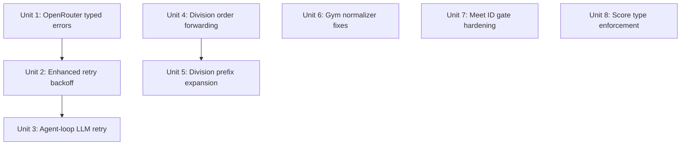

# fix: Michigan Post-Mortem — Reliability & Correctness Fixes

## Overview

The Michigan State Championship run (2026-04-04) completed 38 agent iterations of gym merging and output regeneration before an OpenRouter 502 killed the session. The run also exposed five additional bugs: division_order not forwarded to Python, gym normalizer missing obvious duplicates, meet ID guessing not blocked architecturally, score type mismatches, and no agent-loop-level retry for transient LLM failures.

This plan addresses all six issues in dependency order, prioritizing the two that cause data loss (LLM retry + agent-loop resilience) over the correctness bugs.

## Problem Frame

A single transient OpenRouter outage destroyed 38 iterations of interactive work. The app's retry mechanism (3 attempts, max 8s backoff) is designed for momentary network blips, not provider outages lasting minutes. Beyond that, five correctness bugs each required manual agent intervention during the run — work the normalizer, division detector, and ID validation should have handled automatically.

## Requirements Trace

- R1. Transient LLM API errors (502, 503, 429) must not kill a run — retry with sufficient backoff to survive multi-minute provider outages
- R2. OpenRouter must use typed errors (ApiError, RateLimitError) so existing retry logic handles it identically to Anthropic
- R3. Agent loop must retry the current iteration on transient LLM failure, not abandon the entire run
- R4. `regenerate_output` must forward `division_order` to Python when the agent provides it
- R5. Division detector must support prefix expansion with trailing-space guard ("Ch " matches "Ch A", "Ch B", etc., but not "Charlie")
- R6. Gym normalizer Phase 1 must handle curly apostrophes; harder fuzzy matches (abbreviations, multi-word variants) should surface in gym_report for agent-driven dedup review rather than being fully automated
- R7. Extraction tools must require `search_meets` to have been called before accepting any meet IDs
- R8. Score values must be explicitly cast to float at the DB insertion boundary

## Scope Boundaries

- NOT changing the LLM provider fallback strategy (e.g., auto-switching from OpenRouter to Anthropic on failure)
- NOT adding provider health checks or circuit breakers — simple retry with backoff is sufficient
- NOT rewriting the gym normalizer from scratch — targeted fixes to Phase 1 and Phase 2
- NOT adding TypeScript unit tests for the entire codebase — only for the changed retry logic

## Context & Research

### Relevant Code and Patterns

- `src/main/llm-client.ts:328-378` — existing retry loop with typed error handling for Anthropic but not OpenRouter
- `src/main/llm-client.ts:603-605` — OpenRouter throws plain `Error` instead of `ApiError`/`RateLimitError`
- `src/main/agent-loop.ts:403-416` — LLM error catch block returns immediately with no retry
- `src/main/context-tools.ts:417-422` — division_order saved to context but not pushed to argParts
- `python/core/division_detector.py:80-114` — exact matching with no prefix expansion
- `python/core/gym_normalizer.py:99-155` — Phase 1 case normalization with `str.lower()` key
- `python/core/gym_normalizer.py:195-242` — Phase 2 suffix merge with `_MERGE_SUFFIXES` set
- `python/core/db_builder.py:91-109` — schema declares `REAL` columns
- `python/core/db_builder.py:153-161` — INSERT with no explicit float cast
- `src/main/tools/retry.ts` — existing `fetchWithRetry()` pattern with jitter and configurable backoff
- `src/main/agent-loop.ts:724-730` — meet ID gate (only fires when discoveredMeetIds non-empty)

### Institutional Learnings

- `docs/solutions/integration-issues/division-ordering-was-parsed-from-cli-printed-diagnosticall.md` — prior division_order threading bug (different instance, same pattern)
- `docs/solutions/architecture-patterns/discovery-id-validation-and-tool-gating.md` — progressive tool gating for meet IDs
- `docs/solutions/logic-errors/agents-resumeprogress-system-had-a-critical-sequencing-bug.md` — resume/progress destroyed by ordering bug
- `docs/solutions/architecture-patterns/budget-model-stress-testing.md` — failures are architecture gaps, not model issues

## Key Technical Decisions

- **Retry backoff ceiling of 60s with jitter**: Provider outages typically last 1-5 minutes. 5 retries with exponential backoff (4s, 8s, 16s, 32s, 60s) plus jitter covers ~2 minutes. The agent-loop-level retry adds a second layer for longer outages.
- **Agent-loop retry is separate from llm-client retry**: The llm-client retries individual HTTP requests (fast, seconds-scale). The agent-loop retries the *iteration* (slower, minutes-scale, with progress save between attempts). This two-layer approach means a 5-minute outage is survived without duplicating retry logic.
- **Prefix expansion uses startswith, not fuzzy matching**: "Ch" → matches any division starting with "Ch " (note trailing space to avoid "Charlie" matching "Ch"). This is deterministic and predictable. Fuzzy matching would be surprising.
- **Float cast at INSERT boundary, not adapter**: Defense in depth — even if an adapter passes a string, the INSERT code casts it. The adapters already call `float()` but the INSERT is the last safe checkpoint.
- **Meet ID gate requires search_meets called, not just non-empty discovered list**: Using the existing `context.searchMeetsReturned` flag (or adding one if absent) makes the gate unconditional — extraction tools cannot run until search_meets has returned at least once.

## Open Questions

### Resolved During Planning

- **Q: Should the agent-loop retry indefinitely?** No — cap at 3 loop-level retries with 30s/60s/120s delays. After that, save progress and fail. The user can resume manually.
- **Q: Should OpenRouter 429 use the retry-after header?** Yes — OpenRouter sends `retry-after` headers. Parse them the same way Anthropic's are parsed.
- **Q: Should we add Michigan-specific gym aliases to Supabase?** Not in this plan — the normalizer fixes should catch these automatically. If they still slip through after fixing Phase 1/2, add aliases as a follow-up.

### Deferred to Implementation

- **Exact jitter implementation**: Whether to use full jitter or decorrelated jitter — choose during implementation based on what `retry.ts` already does.
- **Whether `GymTactics/Gymtactics` is a Phase 1 bug or data issue**: Need to reproduce with a unit test against the actual normalizer code.

## Implementation Units

- [ ] **Unit 1: OpenRouter typed errors**

  **Goal:** Make OpenRouter error handling use the same typed error classes as Anthropic, so the retry loop handles all providers identically.

  **Requirements:** R2

  **Dependencies:** None

  **Files:**
  - Modify: `src/main/llm-client.ts`

  **Approach:**
  - In `sendOpenRouter`, replace the plain `throw new Error(...)` with the same pattern used by `handleAnthropicError`:
    - 429 → throw `RateLimitError` with `retryAfterMs` parsed from the `retry-after` response header (default 30s)
    - 500/502/503/520/529 → throw `ApiError` with the status code
    - Other errors → throw `ApiError` with status code (non-transient, won't retry)
  - Truncate the error text body to ~500 chars before embedding in the error message — the Cloudflare HTML page that killed the Michigan run was enormous and polluted the log

  **Patterns to follow:**
  - `handleAnthropicError` at `llm-client.ts:471-479` — exact same typed error pattern

  **Test scenarios:**
  - Happy path: OpenRouter 200 response still works unchanged
  - Error path: 502 response → throws `ApiError` with statusCode 502, truncated message
  - Error path: 429 response with `retry-after: 5` header → throws `RateLimitError` with retryAfterMs=5000
  - Error path: 429 response without retry-after header → throws `RateLimitError` with retryAfterMs=30000
  - Error path: 401 response → throws `ApiError` with statusCode 401 (non-transient)
  - Edge case: Response body is 100KB HTML → error message truncated to ~500 chars

  **Verification:**
  - OpenRouter errors are caught by the existing retry loop's `instanceof RateLimitError` and `instanceof ApiError` checks without any changes to `sendMessage`

- [ ] **Unit 2: Enhanced retry backoff**

  **Goal:** Increase retry capacity from 3 attempts / 8s max to 5 attempts / 60s max with jitter, sufficient to survive multi-minute provider outages.

  **Requirements:** R1

  **Dependencies:** Unit 1 (typed errors must exist for retry to handle them)

  **Files:**
  - Modify: `src/main/llm-client.ts`

  **Approach:**
  - Change `maxRetries` from 3 to 5 in `sendMessage`
  - Change backoff formula from `2^attempt * 1000` to `min(2^attempt * 2000, 60000)` + jitter
  - Add jitter: `delay * (0.5 + Math.random() * 0.5)` to prevent thundering herd on shared providers
  - Update the transient error detection to also match `ApiError` instances by status code (currently string-matching on the message, which is fragile): check `err instanceof ApiError && TRANSIENT_CODES.has(err.statusCode)`
  - Keep the existing string-matching as a fallback for non-typed errors

  **Patterns to follow:**
  - `src/main/tools/retry.ts` — uses a similar jitter + cap pattern for HTTP retries

  **Test scenarios:**
  - Happy path: Succeeds on first attempt — no delay
  - Error path: Transient error on attempts 1-3, succeeds on attempt 4 — delays are ~4s, ~8s, ~16s (with jitter)
  - Error path: Transient error on all 5 attempts — throws after ~2 min total wait, not after 14s
  - Error path: RateLimitError with retryAfterMs=45000 — waits 45s, not the exponential backoff value
  - Error path: Non-transient ApiError (401) — throws immediately on first attempt, no retry
  - Edge case: ApiError(502) detected via instanceof, not string matching

  **Verification:**
  - Total worst-case retry window is ~2 minutes (4s + 8s + 16s + 32s + 60s ± jitter) instead of ~14s

- [ ] **Unit 3: Agent-loop LLM retry**

  **Goal:** When `sendMessage` throws after exhausting its retries, the agent loop should wait and retry the same iteration rather than abandoning the entire run.

  **Requirements:** R1, R3

  **Dependencies:** Unit 2 (enhanced retry must be in place so loop-level retry is the second layer)

  **Files:**
  - Modify: `src/main/agent-loop.ts`

  **Approach:**
  - Wrap the existing LLM call + error handling (lines 403-416) in a loop-level retry:
    - On transient error (RateLimitError or ApiError with transient status code): save progress, wait 30s/60s/120s, retry the same `sendMessage` call with the same messages
    - On non-transient error: fail immediately as today
    - Cap at 3 loop-level retries per iteration
  - Emit `onActivity` messages during the wait so the UI shows "LLM provider error, retrying in 60s..." instead of silently dying
  - The auto-save before each retry ensures no work is lost even if the retry also fails
  - After all loop-level retries exhausted: return `{ success: false }` as today, but the user now has ~6 minutes of retry window (llm-client: ~2min × agent-loop: 3 attempts with 30+60+120s gaps)

  **Patterns to follow:**
  - Existing `doAutoSaveProgress` call pattern at line 414
  - `onActivity` messaging pattern used throughout agent-loop

  **Test scenarios:**
  - Happy path: LLM call succeeds on first try — no loop-level retry, no delay
  - Error path: Transient error, llm-client exhausts 5 retries, agent-loop retries once after 30s → succeeds — run continues normally
  - Error path: All 3 loop-level retries fail — progress is saved, returns `{ success: false }` with clear error
  - Error path: Non-transient error (401 auth) — no loop-level retry, fails immediately
  - Integration: Progress is auto-saved before each loop-level retry wait
  - Integration: UI receives "LLM provider error, retrying in Xs..." activity messages

  **Verification:**
  - A simulated 5-minute OpenRouter outage does not kill a run — the agent resumes when the provider comes back

- [ ] **Unit 4: Division order forwarding in regenerate_output**

  **Goal:** Fix the bug where `regenerate_output` saves division_order to context but doesn't forward it to the Python CLI args.

  **Requirements:** R4

  **Dependencies:** None

  **Files:**
  - Modify: `src/main/context-tools.ts`

  **Approach:**
  - In the `if (args.division_order)` branch at line 418, add `argParts.push('--division-order', String(args.division_order))` alongside the context save
  - Mirror the pattern used by `toolBuildDatabase` (lines 289-295) which correctly does both

  **Patterns to follow:**
  - `toolBuildDatabase` at `context-tools.ts:289-295` — correctly forwards AND saves to context

  **Test scenarios:**
  - Happy path: Agent passes `division_order: "Ch,Jr,Sr,All"` → Python receives `--division-order Ch,Jr,Sr,All` AND context.divisionOrder is set
  - Happy path: Agent omits division_order, context has it from prior call → Python receives `--division-order` from context (existing auto-inject behavior, unchanged)
  - Edge case: Agent omits division_order, no prior context → no `--division-order` flag sent (existing behavior, unchanged)

  **Verification:**
  - `NO_DIVISION_ORDER` warning stops appearing when the agent passes `division_order`

- [ ] **Unit 5: Division prefix expansion in Python**

  **Goal:** Allow shorthand division prefixes ("Ch", "Jr", "Sr") to match all divisions starting with that prefix ("Ch A", "Ch B", etc.).

  **Requirements:** R5

  **Dependencies:** Unit 4 (division_order must actually reach Python first)

  **Files:**
  - Modify: `python/core/division_detector.py`
  - Test: `tests/test_python_core.py`

  **Approach:**
  - In `detect_division_order` (lines 80-103), after building `explicit_upper` from the explicit order list:
    - For each DB division, first try exact match (existing behavior)
    - If no exact match, try prefix match: find any explicit entry where `div.strip().upper().startswith(entry + ' ')` (note: trailing space prevents "Ch" from matching "Charlie")
    - Prefix-matched divisions get the same sort position as their prefix, with a secondary sort alphabetically within the group
  - This means `"Ch,Jr,Sr,All"` produces: all "Ch *" divisions first (alphabetical), then all "Jr *", then all "Sr *", then "All"

  **Patterns to follow:**
  - Existing exact match logic at lines 82-88 — extend, don't replace

  **Test scenarios:**
  - Happy path: Explicit order `["Ch", "Jr", "Sr", "All"]` with DB divisions `["Ch A", "Ch B", "Jr A", "Sr A", "All"]` → ordered as Ch A, Ch B, Jr A, Sr A, All
  - Happy path: Explicit order with full names `["Ch A", "Ch B", "Jr A"]` → exact match still works (no regression)
  - Happy path: Mixed — some full names, some prefixes → both work
  - Edge case: Prefix "Ch" does not match "Charlie" (requires trailing space)
  - Edge case: Division "All" matches exactly, not as prefix of "All Around"
  - Error path: Division "Unknown Div" matches no prefix and no exact entry → goes to unordered list with `UNORDERED_DIVISIONS` warning

  **Verification:**
  - Michigan's 37 divisions are correctly ordered with just `"Ch,Jr,Sr,All"` — no `NO_DIVISION_ORDER` or `UNORDERED_DIVISIONS` warnings

- [ ] **Unit 6: Gym normalizer — fix obvious auto-merges + agent-driven dedup review**

  **Goal:** Fix Phase 1 apostrophe normalization so obvious case/punctuation variants auto-merge. For harder fuzzy matches (abbreviations, multi-word variants), lean on the agent rather than trying to automate every edge case — present the post-normalization gym list to the agent and let it identify suspected duplicates.

  **Requirements:** R6

  **Dependencies:** None

  **Files:**
  - Modify: `python/core/gym_normalizer.py`
  - Modify: `python/core/output_generator.py` (add gym dedup review step to output flow)
  - Test: `tests/test_python_core.py`

  **Approach:**

  **Phase 1 fix — apostrophe normalization (line ~106):**
  - Add curly apostrophe → straight apostrophe normalization to the key-building step: `key = key.replace('\u2019', "'").replace('\u2018', "'")`
  - This ensures `GONYON\u2019S` and `Gonyon's` produce the same lowercase key

  **Phase 2 fix — debug suffix merge:**
  - Reproduce with unit tests first: feed `["Showtime", "Showtime Gymnastics"]` through Phase 2 and check if it merges
  - If Phase 2 is working correctly, the issue is that Phase 1 already collapsed both to one canonical form, so Phase 2 only sees one name. In that case, no Phase 2 fix is needed — just confirm with tests
  - If Phase 2 is NOT merging: check whether `base_to_suffixed` grouping requires the base to exist as a standalone gym (without suffix) and fix that specific issue

  **Agent-driven dedup review (new):**
  - After automated normalization completes, include the full gym list + suspected duplicates (from Phase 2.5 initials detection and Phase 3 fuzzy detection) in the `gym_report` returned to the agent
  - The agent already receives the gym report — ensure it includes enough context (gym names, athlete counts per gym) for the agent to spot matches like "Boyne" / "Boyne Area" / "Boyne Area Gymnastic", "GLE" / "Great Lakes Elite", "MEGA" / "Michigan Elite"
  - The agent can then use the existing `rename_gym` tool or `perplexity_gym_lookup` (verify mode) to confirm and merge
  - This leverages the agent's strength (fuzzy reasoning about gym names) instead of trying to code every edge case

  **Patterns to follow:**
  - Existing Phase 1 normalization at line 106: `key.replace('-', ' ')`
  - Existing `gym_report` structure returned by `normalize()` — already has `potential_duplicates` and `initials_suspects` fields
  - Existing `rename_gym` tool and `perplexity_gym_lookup` tool for agent-driven corrections

  **Test scenarios:**
  - Happy path: `["GONYON'S", "Gonyon\u2019s"]` → merged to one canonical name (Phase 1 apostrophe normalization)
  - Happy path: `["GymTactics", "Gymtactics"]` → merged (Phase 1 case normalization — identical lowercase key)
  - Happy path: `["NorthStar", "Northstar"]` → merged (Phase 1 — same lowercase key)
  - Happy path: `["Showtime", "Showtime Gymnastics"]` → merged to "Showtime Gymnastics" (Phase 2 suffix merge, if not already caught by Phase 1)
  - Happy path: gym_report includes suspected duplicates for agent review
  - Edge case: Existing merges still work — `["Apex", "Apex Gymnastics"]` → merged

  **Verification:**
  - Obvious variants (case, apostrophe, suffix) auto-merge without agent intervention
  - Harder matches (abbreviations, multi-word names) surface in gym_report for agent review
  - Existing pytest tests in `test_python_core.py` still pass (no regressions)

- [ ] **Unit 7: Meet ID gate hardening**

  **Goal:** Require `search_meets` to have been called before any extraction tool accepts meet IDs, regardless of whether discovered IDs are empty or non-empty.

  **Requirements:** R7

  **Dependencies:** None

  **Files:**
  - Modify: `src/main/agent-loop.ts`
  - Modify: `src/main/context-tools.ts` (add field to `ProgressData` interface, serialize/deserialize in save/restore)
  - Modify: `src/main/tool-definitions.ts`

  **Approach:**
  - Reuse the existing `searchMeetsReturned` flag on `AgentContext` (context-tools.ts:54) — do NOT add a second flag. Change its semantics: set it to `true` when `search_meets` returns (regardless of whether results were found), not only on non-empty results. This ensures the gate fires even when the search legitimately finds nothing.
  - In the meet ID gate (lines 724-730), change the condition from `context.discoveredMeetIds && context.discoveredMeetIds.length > 0` to `context.searchMeetsReturned === true`
  - When `searchMeetsReturned` is false and an extraction tool is called: return error "You must call search_meets first to discover valid meet IDs before using extraction tools."
  - When `searchMeetsReturned` is true but the provided ID is not in `discoveredMeetIds`: return existing error about undiscovered IDs
  - Add `searchMeetsReturned` to the `ProgressData` interface and the serialization/deserialization code so it survives save/resume (per institutional learning about guard flags). Follow the pattern used by `discovered_meet_ids` in the same interface.
  - Update `mso_extract` and `scorecat_extract` tool descriptions to include: "IDs must come from search_meets results"

  **Patterns to follow:**
  - Existing `discoveredMeetIds` pattern at `agent-loop.ts:676-730`
  - `ProgressData` serialization pattern for persisting flags across save/resume
  - Institutional learning: `docs/solutions/logic-errors/persist-destructive-operation-guards.md`

  **Test scenarios:**
  - Happy path: `search_meets` called → returns IDs → `mso_extract` called with discovered ID → allowed
  - Error path: `mso_extract` called before `search_meets` → blocked with "call search_meets first"
  - Error path: `search_meets` called → `scorecat_extract` called with invented ID → blocked with "not found by search_meets"
  - Integration: `searchMeetsCalled` survives save/resume — extraction tools still gated after resume
  - Edge case: `search_meets` returns zero results → `searchMeetsCalled` is true, but `discoveredMeetIds` is empty → extraction with any ID is blocked (no IDs to match against)

  **Verification:**
  - An agent cannot call extraction tools without first calling `search_meets`, regardless of model capability

- [ ] **Unit 8: Score type enforcement at DB insertion**

  **Goal:** Ensure all score values are explicitly cast to float (or None) at the SQLite INSERT boundary, as defense in depth.

  **Requirements:** R8

  **Dependencies:** None

  **Files:**
  - Modify: `python/core/db_builder.py`
  - Test: `tests/test_python_core.py`

  **Approach:**
  - Add a `_to_float(val)` helper near the INSERT code that returns `float(val)` if val is not None and is numeric, else `None`
  - Wrap each score field in the INSERT: `_to_float(a['vault']), _to_float(a['bars']), ...`
  - This mirrors the pattern the adapters already use but provides a safety net at the DB boundary
  - Log a warning if a non-numeric string is encountered (indicates an adapter bug)

  **Patterns to follow:**
  - `scorecat_adapter.py:161-173` `_parse_score()` — same float-or-None pattern

  **Test scenarios:**
  - Happy path: Float scores (9.5, 10.0) → stored as REAL, queryable with `MAX()`
  - Happy path: None scores → stored as NULL
  - Edge case: String score "9.500" → cast to float 9.5, stored as REAL
  - Edge case: Empty string "" → stored as NULL (not as empty string)
  - Edge case: Non-numeric string "DNS" → stored as NULL with warning logged
  - Error path: Score type `int` (9) → cast to float 9.0

  **Verification:**
  - `SELECT typeof(vault) FROM results` returns only `'real'` or `'null'`, never `'text'`
  - Winner calculation (`MAX()`) works correctly without type comparison errors

## System-Wide Impact

- **Interaction graph:** Units 1-3 (retry) are layered: llm-client retry → agent-loop retry. Tool-level retries (`retry.ts`) are unaffected. The `onActivity` callback propagates retry status to the React UI.
- **Error propagation:** Transient LLM errors are now absorbed at two levels before reaching the UI. Non-transient errors still fail fast.
- **State lifecycle risks:** Agent-loop retry saves progress before each wait — if the process is killed during a retry wait, progress is preserved. The `searchMeetsCalled` flag must be added to `ProgressData` to survive save/resume.
- **API surface parity:** No external API changes. The inner agent's tool interface is unchanged.
- **Unchanged invariants:** `fetchWithRetry` (tool-level HTTP retry) is not modified. Anthropic and Subscription provider paths are not modified (they already use typed errors).

## Risks & Dependencies

| Risk | Mitigation |
|------|------------|
| Extended retry delays block the UI | onActivity messages keep the user informed; auto-save ensures no work lost if user force-quits |
| Prefix expansion matches unintended divisions | Trailing space in startswith prevents partial word matches; exact match takes priority |
| Gym normalizer changes cause regressions on other states | Existing pytest tests cover Iowa/Colorado/Utah; run full suite before merging |
| Score float cast masks upstream adapter bugs | Log a warning when a non-float value is cast, so adapter bugs are visible |

## Sources & References

- Related learnings: `docs/solutions/integration-issues/division-ordering-was-parsed-from-cli-printed-diagnosticall.md`
- Related learnings: `docs/solutions/architecture-patterns/discovery-id-validation-and-tool-gating.md`
- Related learnings: `docs/solutions/logic-errors/persist-destructive-operation-guards.md`
- Michigan run log: `C:\Users\goduk\Downloads\USAG_Women_s_Gymnastics_State_Championship___Michi_2026-04-03T19-40-44.md`
